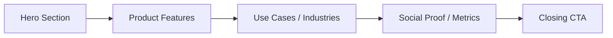

# Design Document: Antigravity Landing Page

## Overview

This design covers the full implementation of the Antigravity landing page — a premium, single-page marketing site for Kenesis Labs' AI-powered visual intelligence platform serving manufacturing and industrial sectors. The brand name for the landing page is "Kenesis" with the tagline "See Everything. Miss Nothing." and sub-line "Visual Intelligence for Industry."

The visual identity follows the Kenesis Art Direction and Design System: a dark, industrial-precision aesthetic built on six core design principles. Orange (#FF6B35) is the single accent color and sole light source. The dark canvas (#070810) grounds everything. Glassmorphic elements float above the dark base while skeuomorphic controls feel physical and tactile. Typography does the heavy lifting — large, heavy headlines with monospace (JetBrains Mono) for all technical data. Shadows encode hierarchy. The 8px grid enforces industrial precision throughout.

The implementation is a Next.js application using the App Router with static export (`output: 'export'`), styled with Tailwind CSS v4. All design tokens are expressed as CSS custom properties consumed by Tailwind's theme configuration. React components replace raw HTML sections, with GSAP + ScrollTrigger for scroll-driven animations and Framer Motion for component-level animations.

### Kenesis Design Principles

1. **Depth Before Decoration** — Atmospheric layering (gradients, glows, blur) creates physical depth. No decorative patterns or illustrations.
2. **Glass Floats, Steel Grounds** — Glassmorphic elements float above the dark base. Skeuomorphic controls feel physical and tactile. Never mix on the same layer.
3. **One Accent. One Glow.** — Orange (#FF6B35) is the ONLY light source. Everything else is dark gray or white. Status colors (green/amber/red) are functional only.
4. **Type Does the Work** — Headlines large and heavy. Monospace for all data and technical values. No decorative fonts.
5. **Shadows Are Purposeful** — Shadows encode hierarchy: flat = inactive, soft = elevated, strong = modal. Glow shadows (orange) = active/interactive.
6. **Industrial Precision** — 8px grid always. Monospace for technical data. HUD corners on camera feeds. Terminal-style logs. Control room aesthetic.

### Key Design Decisions

1. **Next.js App Router with Static Export** — The landing page is a statically exported Next.js site. No server-side runtime. `next.config.js` sets `output: 'export'` for fully static builds suitable for any CDN or static host.
2. **Tailwind CSS v4 for Styling** — All component styling uses Tailwind utility classes. Design tokens are defined as CSS custom properties in a global CSS file and consumed by Tailwind via `@theme` configuration.
3. **CSS Custom Properties as Design Tokens** — Colors, shadows, glows, spacing, and animation timings are expressed as CSS variables in a global stylesheet following the Kenesis Design System specification exactly.
4. **GSAP for Scroll-Driven Animations** — All scroll-triggered animations (parallax, scrollytelling, text reveals) use GSAP with the ScrollTrigger plugin for precise, performant scroll-driven motion at 60fps.
5. **Framer Motion for Component Animations** — React component enter/exit animations, hover states, layout animations, and simple transitions use Framer Motion with `AnimatePresence` for mount/unmount animations.
6. **`prefers-reduced-motion` Respect** — A `useReducedMotion` hook detects the user's preference and disables both GSAP and Framer Motion animations when reduced motion is requested.
7. **Semantic HTML + ARIA** — Every section uses semantic elements and ARIA attributes where needed for accessibility.
8. **Progressive Enhancement** — The page is fully readable without JavaScript. Animations and parallax are layered on top via client components.
9. **JetBrains Mono for Technical Data** — All metrics, stats, data readouts, and technical values use JetBrains Mono monospace font per the Kenesis design system.
10. **Orange as Sole Accent** — No secondary accent color. Orange (#FF6B35) is the only brand color used for glows, CTAs, active states, and highlights. Status colors (green, amber, red) are functional only.

## Architecture

The landing page follows a component-based architecture using Next.js App Router, with a clear separation between server components (static content), client components (interactive behavior), and the Tailwind-powered design token system.

```mermaid
graph TD
    subgraph "Next.js App Router"
        Layout["app/layout.tsx (Root Layout)"]
        Page["app/page.tsx (Landing Page)"]
    end

    subgraph "React Components"
        Nav["NavigationBar (client)"]
        Hero["HeroSection (client)"]
        Features["FeaturesSection (client)"]
        UseCases["UseCasesSection (client)"]
        SocialProof["SocialProofSection (client)"]
        CTA["CTASection (client)"]
        Footer["Footer (server)"]
    end

    subgraph "Shared UI Components"
        GlassCard["GlassCard"]
        GlowButton["GlowButton (Skeuomorphic Primary)"]
        GhostButton["GhostButton"]
        GlassPillButton["GlassPillButton (Hydraoo-style)"]
        Badge["Badge (Status Badges)"]
        MetricCard["SkeuomorphicMetricCard"]
        CameraFeedCard["CameraFeedCard (HUD Corners)"]
        CommandPanel["CommandPanel (Terminal-style)"]
        InputField["InputField"]
        SectionContainer["SectionContainer"]
    end

    subgraph "Animation Libraries"
        GSAP["GSAP + ScrollTrigger"]
        FramerMotion["Framer Motion"]
    end

    subgraph "Custom Hooks (Behavior)"
        UseIO["useIntersectionObserver (Framer Motion useInView)"]
        UseParallax["useParallax (GSAP ScrollTrigger)"]
        UseScrollytelling["useScrollytelling (GSAP ScrollTrigger pin/snap)"]
        UseCountUp["useCountUp (GSAP / rAF)"]
        UseTextAnim["useTextAnimation (GSAP timeline)"]
        UseReducedMotion["useReducedMotion"]
    end

    subgraph "Style Layer"
        GlobalCSS["globals.css (Kenesis tokens + Tailwind directives)"]
        TailwindConfig["Tailwind v4 @theme (consumes CSS vars)"]
    end

    Layout --> Page
    Page --> Nav
    Page --> Hero
    Page --> Features
    Page --> UseCases
    Page --> SocialProof
    Page --> CTA
    Page --> Footer

    Hero --> GlassCard
    Hero --> GlowButton
    Hero --> MetricCard
    Features --> GlassCard
    Features --> CameraFeedCard
    UseCases --> Badge
    UseCases --> CommandPanel
    SocialProof --> MetricCard
    CTA --> GlassCard
    CTA --> GlowButton

    Hero --> UseParallax
    Hero --> UseTextAnim
    Features --> UseIO
    UseCases --> UseScrollytelling
    SocialProof --> UseCountUp
    CTA --> UseTextAnim
    Nav --> UseReducedMotion
    Nav --> FramerMotion

    UseParallax --> GSAP
    UseScrollytelling --> GSAP
    UseTextAnim --> GSAP
    UseIO --> FramerMotion
    UseCountUp --> GSAP

    GlobalCSS --> TailwindConfig
```



### Section Flow

The page renders sections in this order, each occupying at least one full viewport height:



A fixed glassmorphism navigation bar overlays all sections.

### Project Structure

```
antigravity-landing/
├── app/
│   ├── layout.tsx              # Root layout (fonts, metadata, global styles)
│   ├── page.tsx                # Landing page (composes all sections)
│   └── globals.css             # Kenesis design tokens + Tailwind directives
├── components/
│   ├── ui/                     # Shared UI primitives
│   │   ├── GlassCard.tsx
│   │   ├── GlowButton.tsx      # Skeuomorphic primary button
│   │   ├── GhostButton.tsx     # Ghost variant
│   │   ├── GlassPillButton.tsx # Hydraoo-style glass pill CTA
│   │   ├── Badge.tsx           # Status badges (NORMAL/WARNING/CRITICAL/OFFLINE/LIVE)
│   │   ├── MetricCard.tsx      # Skeuomorphic metric card
│   │   ├── CameraFeedCard.tsx  # Camera feed with HUD corners
│   │   ├── CommandPanel.tsx    # Terminal-style command panel
│   │   ├── InputField.tsx
│   │   └── SectionContainer.tsx
│   ├── NavigationBar.tsx       # Fixed glassmorphism nav (client, Framer Motion)
│   ├── HeroSection.tsx         # Hero with GSAP parallax + text anim (client)
│   ├── FeaturesSection.tsx     # Feature cards grid (client, Framer Motion)
│   ├── UseCasesSection.tsx     # GSAP ScrollTrigger scrollytelling (client)
│   ├── SocialProofSection.tsx  # Metrics with GSAP count-up (client)
│   ├── CTASection.tsx          # Closing CTA (client)
│   └── Footer.tsx              # Footer (server)
├── hooks/
│   ├── useIntersectionObserver.ts
│   ├── useParallax.ts
│   ├── useScrollytelling.ts
│   ├── useCountUp.ts
│   ├── useTextAnimation.ts
│   └── useReducedMotion.ts
├── lib/
│   └── gsap.ts                 # GSAP plugin registration (ScrollTrigger)
├── next.config.js
├── next-sitemap.config.js
├── tailwind.config.ts
├── tsconfig.json
└── package.json
```

## Components and Interfaces

### 1. Design Token System (Kenesis)

All tokens live in `app/globals.css` as CSS custom properties consumed by Tailwind CSS v4 via `@theme` directives. These tokens are taken directly from the Kenesis Art Direction and Design System document.

#### globals.css Structure

```css
@import "tailwindcss";

@theme {
  /* ===== KENESIS COLOR SYSTEM ===== */

  /* Brand & Accent — Orange is the ONLY light source */
  --color-brand: #FF6B35;
  --color-brand-dark: #E55520;
  --color-brand-light: #FF9A70;
  --color-brand-pale: #FFF0E8;

  /* Dark Canvas */
  --color-bg-dark: #070810;
  --color-surface-dark: #0a0d1a;
  --color-border-dark: #1F2937;

  /* Neutral Grays */
  --color-gray-900: #111827;
  --color-gray-700: #374151;
  --color-gray-500: #6B7280;

  /* Text */
  --color-text-primary: #F9FAFB;
  --color-text-muted: rgba(255, 255, 255, 0.4);
  --color-white: #FFFFFF;

  /* Glass */
  --color-bg-glass: rgba(255, 255, 255, 0.06);
  --color-border-glass: rgba(255, 255, 255, 0.12);
  --color-border-glass-top: rgba(255, 255, 255, 0.20);
  --color-glass-inset: rgba(255, 255, 255, 0.08);

  /* Status Colors (ISA-101 Standard) — Functional only */
  --color-status-ok: #22C55E;
  --color-status-ok-dark: #16A34A;
  --color-status-warn: #F59E0B;
  --color-status-warn-dark: #D97706;
  --color-status-alert: #EF4444;
  --color-status-alert-dark: #DC2626;
  --color-info: #3B82F6;
  --color-info-dark: #1D4ED8;

  /* ===== SHADOW & GLOW SYSTEM ===== */

  /* Elevation Shadows */
  --shadow-flat: none;
  --shadow-sm: 0 2px 8px rgba(0, 0, 0, 0.08);
  --shadow-md: 0 4px 20px rgba(0, 0, 0, 0.14);
  --shadow-lg: 0 8px 40px rgba(0, 0, 0, 0.22);

  /* Glow Shadows */
  --shadow-glow-brand: 0 0 20px rgba(255, 107, 53, 0.5);
  --shadow-glow-brand-hover: 0 0 30px rgba(255, 107, 53, 0.7);
  --shadow-glow-green: 0 0 16px rgba(34, 197, 94, 0.45);
  --shadow-glow-red: 0 0 16px rgba(239, 68, 68, 0.5);

  /* Glass Shadow */
  --shadow-glass: 0 8px 32px rgba(0, 0, 0, 0.3), inset 0 1px 0 rgba(255, 255, 255, 0.08);

  /* Skeuomorphic Emboss */
  --shadow-skeu-emboss: inset 0 1px 0 rgba(255, 255, 255, 0.15), 0 4px 20px rgba(0, 0, 0, 0.14);

  /* ===== SPACING (8px grid) ===== */
  --space-1: 4px;
  --space-2: 8px;
  --space-3: 12px;
  --space-4: 16px;
  --space-6: 24px;
  --space-8: 32px;
  --space-12: 48px;

  /* ===== RADIUS ===== */
  --radius-sm: 3px;
  --radius-md: 6px;
  --radius-lg: 10px;
  --radius-pill: 9999px;

  /* ===== TYPOGRAPHY ===== */
  --font-family-heading: system-ui, -apple-system, sans-serif;
  --font-family-body: system-ui, -apple-system, sans-serif;
  --font-mono: 'JetBrains Mono', monospace;

  /* Type Scale (Kenesis) */
  --font-size-display: 56px;    /* 900 weight — Hero headlines */
  --font-size-h1: 36px;         /* 900 weight — Page titles */
  --font-size-h2: 26px;         /* 800 weight — Section headings */
  --font-size-h3: 18px;         /* 700 weight — Card titles */
  --font-size-body-lg: 16px;    /* 400 weight — Hero subtitles, primary reading */
  --font-size-body: 14px;       /* 400 weight — Standard body, cards */
  --font-size-label: 10px;      /* 700 weight CAPS — Tags, section labels */
  --font-size-mono: 12px;       /* 400 weight — Data, readings, codes */

  /* ===== ANIMATION ===== */
  --duration-fast: 200ms;
  --duration-medium: 300ms;
  --duration-slow: 600ms;
  --duration-hero-text: 1500ms;
  --duration-count-up: 1200ms;
  --duration-scrollytelling: 500ms;
  --duration-cta-text: 800ms;
  --ease-default: cubic-bezier(0.4, 0, 0.2, 1);
  --ease-bounce: cubic-bezier(0.34, 1.56, 0.64, 1);
  --ease-smooth: cubic-bezier(0.25, 0.1, 0.25, 1);
}
```

#### Color Tokens

| Token | Role | Value |
|---|---|---|
| `--color-brand` | Primary accent, CTAs, glow source | `#FF6B35` (orange) |
| `--color-brand-dark` | Hover/pressed accent | `#E55520` |
| `--color-brand-light` | Light accent variant | `#FF9A70` |
| `--color-brand-pale` | Pale accent for subtle backgrounds | `#FFF0E8` |
| `--color-bg-dark` | Page background (near-black canvas) | `#070810` |
| `--color-surface-dark` | Card/panel surface | `#0a0d1a` |
| `--color-border-dark` | Dark borders | `#1F2937` |
| `--color-gray-900` | Deep gray | `#111827` |
| `--color-gray-700` | Mid gray | `#374151` |
| `--color-gray-500` | Light gray | `#6B7280` |
| `--color-text-primary` | Headings, primary copy | `#F9FAFB` |
| `--color-text-muted` | Body copy, captions | `rgba(255, 255, 255, 0.4)` |
| `--color-white` | Pure white | `#FFFFFF` |

#### Status Colors (ISA-101 Standard)

| Token | Role | Value |
|---|---|---|
| `--color-status-ok` | Normal/OK status | `#22C55E` |
| `--color-status-ok-dark` | OK dark variant | `#16A34A` |
| `--color-status-warn` | Warning status | `#F59E0B` |
| `--color-status-warn-dark` | Warning dark variant | `#D97706` |
| `--color-status-alert` | Alert/critical status | `#EF4444` |
| `--color-status-alert-dark` | Alert dark variant | `#DC2626` |
| `--color-info` | Info status | `#3B82F6` |
| `--color-info-dark` | Info dark variant | `#1D4ED8` |

#### Shadow & Glow Tokens

| Token | Usage | Value |
|---|---|---|
| `--shadow-flat` | Default/inactive | `none` |
| `--shadow-sm` | Subtle elevation | `0 2px 8px rgba(0, 0, 0, 0.08)` |
| `--shadow-md` | Elevated cards | `0 4px 20px rgba(0, 0, 0, 0.14)` |
| `--shadow-lg` | Modals, prominent elements | `0 8px 40px rgba(0, 0, 0, 0.22)` |
| `--shadow-glow-brand` | Active state, brand elements | `0 0 20px rgba(255, 107, 53, 0.5)` |
| `--shadow-glow-brand-hover` | Hover on brand elements | `0 0 30px rgba(255, 107, 53, 0.7)` |
| `--shadow-glow-green` | Status OK glow | `0 0 16px rgba(34, 197, 94, 0.45)` |
| `--shadow-glow-red` | Alert/critical glow | `0 0 16px rgba(239, 68, 68, 0.5)` |
| `--shadow-glass` | Glass panel lift | `0 8px 32px rgba(0, 0, 0, 0.3), inset 0 1px 0 rgba(255, 255, 255, 0.08)` |
| `--shadow-skeu-emboss` | Raised card emboss | `inset 0 1px 0 rgba(255, 255, 255, 0.15), 0 4px 20px rgba(0, 0, 0, 0.14)` |

#### Glassmorphism Recipe (exact from Kenesis spec)

```css
/* Applied to all glass elements */
background: rgba(255, 255, 255, 0.06);
border: 1px solid rgba(255, 255, 255, 0.12);
border-top: 1px solid rgba(255, 255, 255, 0.20); /* highlight edge */
backdrop-filter: blur(12px); /* frosted glass */
box-shadow: 0 8px 32px rgba(0, 0, 0, 0.3), inset 0 1px 0 rgba(255, 255, 255, 0.08);
```

#### Spacing Scale (8px grid)

| Token | Value |
|---|---|
| `--space-1` | `4px` |
| `--space-2` | `8px` |
| `--space-3` | `12px` |
| `--space-4` | `16px` |
| `--space-6` | `24px` |
| `--space-8` | `32px` |
| `--space-12` | `48px` |

#### Radius Tokens

| Token | Value |
|---|---|
| `--radius-sm` | `3px` |
| `--radius-md` | `6px` |
| `--radius-lg` | `10px` |
| `--radius-pill` | `9999px` |

#### Typography Scale (Kenesis)

| Level | Size | Weight | Usage |
|---|---|---|---|
| Display | 56px | 900 | Hero headlines |
| H1 | 36px | 900 | Page titles |
| H2 | 26px | 800 | Section headings |
| H3 | 18px | 700 | Card titles |
| Body LG | 16px | 400 | Hero subtitles, primary reading |
| Body | 14px | 400 | Standard body, cards |
| Label | 10px | 700 CAPS | Tags, section labels |
| Mono | 12px | 400 | Data, readings, codes (JetBrains Mono) |

Font families: System sans-serif for headings/body, JetBrains Mono for monospace data.

#### Animation Timing Tokens

| Token | Usage | Value |
|---|---|---|
| `--duration-fast` | Hover, focus states | `200ms` |
| `--duration-medium` | Card transitions, menu | `300ms` |
| `--duration-slow` | Text animations, fade-ins | `600ms` |
| `--duration-hero-text` | Hero headline animation | `1500ms` |
| `--duration-count-up` | Metric count-up | `1200ms` |
| `--duration-scrollytelling` | Use-case panel transition | `500ms` |
| `--duration-cta-text` | Closing CTA headline | `800ms` |
| `--ease-default` | General transitions | `cubic-bezier(0.4, 0, 0.2, 1)` |
| `--ease-bounce` | Playful entrances | `cubic-bezier(0.34, 1.56, 0.64, 1)` |
| `--ease-smooth` | Scroll-driven motion | `cubic-bezier(0.25, 0.1, 0.25, 1)` |

#### Responsive Breakpoints

| Breakpoint | Range |
|---|---|
| Mobile | `≤ 768px` |
| Tablet | `769px – 1024px` |
| Desktop | `≥ 1025px` |

### 2. Shared UI Components (React)

All shared UI components live in `components/ui/`. They accept Tailwind classes via a `className` prop for composition.

#### GlassCard

A frosted-glass panel using the exact Kenesis glassmorphism recipe. Used for feature cards, use-case panels, and overlay containers.

```tsx
// components/ui/GlassCard.tsx
"use client";

interface GlassCardProps {
  children: React.ReactNode;
  className?: string;
  hover?: boolean;
}

export function GlassCard({ children, className = "", hover = true }: GlassCardProps) {
  return (
    <div
      className={`
        bg-[rgba(255,255,255,0.06)]
        backdrop-blur-[12px]
        border border-[rgba(255,255,255,0.12)]
        border-t-[rgba(255,255,255,0.20)]
        rounded-[var(--radius-lg)]
        shadow-glass
        p-[var(--space-8)]
        ${hover ? "transition-shadow duration-medium ease-default hover:shadow-lg" : ""}
        ${className}
      `}
      style={{
        boxShadow: "0 8px 32px rgba(0,0,0,0.3), inset 0 1px 0 rgba(255,255,255,0.08)",
      }}
    >
      {children}
    </div>
  );
}
```

#### GlowButton (Skeuomorphic Primary)

The primary CTA button following the Kenesis skeuomorphism spec: 3-stop gradient, inset highlight, drop shadow, text-shadow, and orange glow.

```tsx
// components/ui/GlowButton.tsx
"use client";

interface GlowButtonProps {
  children: React.ReactNode;
  href?: string;
  className?: string;
  onClick?: () => void;
}

export function GlowButton({ children, href, className = "", onClick }: GlowButtonProps) {
  const classes = `
    inline-block text-white font-bold cursor-pointer
    rounded-[var(--radius-md)]
    px-[var(--space-8)] py-[var(--space-4)]
    border-none
    transition-all duration-fast ease-default
    hover:-translate-y-0.5
    focus-visible:outline-2 focus-visible:outline-brand focus-visible:outline-offset-4
    ${className}
  `;

  const style: React.CSSProperties = {
    background: "linear-gradient(180deg, #FF9A70 0%, #FF6B35 50%, #E55520 100%)",
    boxShadow: "0 0 20px rgba(255,107,53,0.4), 0 4px 20px rgba(0,0,0,0.14), inset 0 1px 0 rgba(255,255,255,0.25)",
    textShadow: "0 1px 2px rgba(0,0,0,0.3)",
  };

  const hoverStyle = {
    background: "linear-gradient(180deg, #FF8A60 0%, #E55520 50%, #CC4410 100%)",
    boxShadow: "0 0 30px rgba(255,107,53,0.7), 0 8px 40px rgba(0,0,0,0.22), inset 0 1px 0 rgba(255,255,255,0.25)",
  };

  if (href) {
    return <a href={href} className={classes} style={style}>{children}</a>;
  }
  return <button onClick={onClick} className={classes} style={style}>{children}</button>;
}
```

#### GhostButton

A transparent button variant with orange border and text.

```tsx
// components/ui/GhostButton.tsx
"use client";

interface GhostButtonProps {
  children: React.ReactNode;
  href?: string;
  className?: string;
  onClick?: () => void;
}

export function GhostButton({ children, href, className = "", onClick }: GhostButtonProps) {
  const classes = `
    inline-block bg-transparent text-brand
    border border-brand rounded-[var(--radius-md)]
    px-[var(--space-8)] py-[var(--space-4)]
    font-bold cursor-pointer
    transition-all duration-fast ease-default
    hover:bg-brand/10 hover:shadow-glow-brand
    focus-visible:outline-2 focus-visible:outline-brand focus-visible:outline-offset-4
    ${className}
  `;

  if (href) {
    return <a href={href} className={classes}>{children}</a>;
  }
  return <button onClick={onClick} className={classes}>{children}</button>;
}
```

#### GlassPillButton (Hydraoo-style)

A glass pill CTA button inspired by the Hydraoo reference in the Kenesis art direction.

```tsx
// components/ui/GlassPillButton.tsx
"use client";

interface GlassPillButtonProps {
  children: React.ReactNode;
  href?: string;
  className?: string;
  onClick?: () => void;
}

export function GlassPillButton({ children, href, className = "", onClick }: GlassPillButtonProps) {
  const classes = `
    inline-block text-text-primary font-bold cursor-pointer
    rounded-[var(--radius-pill)]
    px-[var(--space-6)] py-[var(--space-3)]
    bg-[rgba(255,255,255,0.06)]
    backdrop-blur-[12px]
    border border-[rgba(255,255,255,0.12)]
    transition-all duration-fast ease-default
    hover:bg-[rgba(255,255,255,0.10)] hover:shadow-glass
    focus-visible:outline-2 focus-visible:outline-brand focus-visible:outline-offset-4
    ${className}
  `;

  if (href) {
    return <a href={href} className={classes}>{children}</a>;
  }
  return <button onClick={onClick} className={classes}>{children}</button>;
}
```

#### Badge (Status Badges)

Status badges following ISA-101 standard: NORMAL (green), WARNING (amber), CRITICAL (red), OFFLINE (gray), LIVE (orange glow).

```tsx
// components/ui/Badge.tsx
type BadgeVariant = "normal" | "warning" | "critical" | "offline" | "live" | "default";

interface BadgeProps {
  children: React.ReactNode;
  variant?: BadgeVariant;
  className?: string;
}

const variantStyles: Record<BadgeVariant, { bg: string; text: string; glow?: string }> = {
  normal:   { bg: "bg-status-ok/20",    text: "text-status-ok",    glow: "shadow-glow-green" },
  warning:  { bg: "bg-status-warn/20",  text: "text-status-warn" },
  critical: { bg: "bg-status-alert/20", text: "text-status-alert", glow: "shadow-glow-red" },
  offline:  { bg: "bg-gray-700/30",     text: "text-gray-500" },
  live:     { bg: "bg-brand/20",        text: "text-brand",        glow: "shadow-glow-brand" },
  default:  { bg: "bg-[rgba(255,255,255,0.06)]", text: "text-brand" },
};

export function Badge({ children, variant = "default", className = "" }: BadgeProps) {
  const v = variantStyles[variant];
  return (
    <span
      className={`
        inline-block rounded-[var(--radius-pill)]
        px-[var(--space-3)] py-[var(--space-1)]
        text-[var(--font-size-label)] font-bold uppercase tracking-wider
        ${v.bg} ${v.text} ${v.glow ?? ""}
        ${className}
      `}
    >
      {children}
    </span>
  );
}
```

#### SkeuomorphicMetricCard

A tactile, dashboard-style card following the Kenesis skeuomorphism spec: embossed white border, multi-layer shadow, dark inner panel with deep shadow, and orange text-shadow glow on the metric value.

```tsx
// components/ui/MetricCard.tsx
"use client";

interface MetricCardProps {
  value: React.ReactNode;
  label: string;
  className?: string;
}

export function MetricCard({ value, label, className = "" }: MetricCardProps) {
  return (
    <div
      className={`
        bg-surface-dark rounded-[var(--radius-lg)]
        p-[var(--space-8)] text-center
        ${className}
      `}
      style={{
        boxShadow: "inset 0 1px 0 rgba(255,255,255,0.15), 0 4px 20px rgba(0,0,0,0.14), 0 8px 40px rgba(0,0,0,0.22)",
        border: "1px solid rgba(255,255,255,0.10)",
      }}
    >
      <div
        className="text-[56px] font-black text-brand font-mono"
        style={{ textShadow: "0 0 20px rgba(255,107,53,0.4)" }}
      >
        {value}
      </div>
      <div className="text-[var(--font-size-body)] text-text-muted mt-[var(--space-2)]">
        {label}
      </div>
    </div>
  );
}
```

#### CameraFeedCard

An industrial camera feed card with HUD corners, glow status badge, and monospace data overlay. This is a Kenesis-specific component reflecting the control room aesthetic.

```tsx
// components/ui/CameraFeedCard.tsx
"use client";

import { Badge } from "./Badge";

interface CameraFeedCardProps {
  title: string;
  status: "normal" | "warning" | "critical" | "offline" | "live";
  streamId: string;
  detections?: number;
  children?: React.ReactNode; // feed visual / placeholder
  className?: string;
}

export function CameraFeedCard({
  title, status, streamId, detections, children, className = ""
}: CameraFeedCardProps) {
  return (
    <div
      className={`
        relative bg-bg-dark rounded-[var(--radius-md)] overflow-hidden
        border border-border-dark
        ${className}
      `}
    >
      {/* HUD Corners — orange corner brackets */}
      <div className="absolute top-0 left-0 w-4 h-4 border-t-2 border-l-2 border-brand" />
      <div className="absolute top-0 right-0 w-4 h-4 border-t-2 border-r-2 border-brand" />
      <div className="absolute bottom-0 left-0 w-4 h-4 border-b-2 border-l-2 border-brand" />
      <div className="absolute bottom-0 right-0 w-4 h-4 border-b-2 border-r-2 border-brand" />

      {/* Feed area */}
      <div className="aspect-video bg-gray-900 relative">
        {children}
        {/* Detection box overlay example */}
        {detections !== undefined && (
          <div className="absolute bottom-2 left-2 font-mono text-[var(--font-size-mono)] text-brand">
            {detections} detections
          </div>
        )}
      </div>

      {/* Info bar */}
      <div className="flex items-center justify-between p-[var(--space-3)]">
        <div>
          <div className="text-[var(--font-size-h3)] font-bold text-text-primary">{title}</div>
          <div className="font-mono text-[var(--font-size-mono)] text-text-muted">{streamId}</div>
        </div>
        <Badge variant={status}>{status.toUpperCase()}</Badge>
      </div>
    </div>
  );
}
```

#### CommandPanel

A terminal-style command panel with dark background, monospace data, and orange accents. Reflects the industrial terminal aesthetic from the Kenesis design system.

```tsx
// components/ui/CommandPanel.tsx
"use client";

interface CommandPanelProps {
  title: string;
  children: React.ReactNode;
  className?: string;
}

export function CommandPanel({ title, children, className = "" }: CommandPanelProps) {
  return (
    <div
      className={`
        bg-bg-dark border border-border-dark rounded-[var(--radius-md)]
        overflow-hidden
        ${className}
      `}
    >
      {/* Title bar */}
      <div className="flex items-center gap-[var(--space-2)] px-[var(--space-4)] py-[var(--space-2)] border-b border-border-dark">
        <div className="w-2 h-2 rounded-full bg-status-alert" />
        <div className="w-2 h-2 rounded-full bg-status-warn" />
        <div className="w-2 h-2 rounded-full bg-status-ok" />
        <span className="text-[var(--font-size-label)] font-bold uppercase tracking-wider text-text-muted ml-[var(--space-2)]">
          {title}
        </span>
      </div>
      {/* Content */}
      <div className="p-[var(--space-4)] font-mono text-[var(--font-size-mono)] text-text-primary">
        {children}
      </div>
    </div>
  );
}
```

#### InputField

A styled text input using Kenesis tokens.

```tsx
// components/ui/InputField.tsx
"use client";

import { forwardRef } from "react";

interface InputFieldProps extends React.InputHTMLAttributes<HTMLInputElement> {
  className?: string;
}

export const InputField = forwardRef<HTMLInputElement, InputFieldProps>(
  ({ className = "", ...props }, ref) => {
    return (
      <input
        ref={ref}
        className={`
          bg-[rgba(255,255,255,0.05)] border border-border-dark rounded-[var(--radius-md)]
          px-[var(--space-6)] py-[var(--space-4)]
          text-text-primary text-[var(--font-size-body)]
          transition-all duration-fast ease-default
          focus:border-brand focus:shadow-[0_0_0_3px_rgba(255,107,53,0.2)] focus:outline-none
          ${className}
        `}
        {...props}
      />
    );
  }
);
InputField.displayName = "InputField";
```

#### SectionContainer

A wrapper for each page section providing consistent vertical spacing and max-width.

```tsx
// components/ui/SectionContainer.tsx
interface SectionContainerProps {
  children: React.ReactNode;
  id?: string;
  className?: string;
  as?: "section" | "div";
}

export function SectionContainer({
  children, id, className = "", as: Tag = "section",
}: SectionContainerProps) {
  return (
    <Tag id={id} className={`max-w-[1200px] mx-auto px-[var(--space-8)] py-[var(--space-12)] relative ${className}`}>
      {children}
    </Tag>
  );
}
```

### 3. Custom Hooks (Behavior Layer)

All interactive behavior is encapsulated in custom React hooks under `hooks/`.

#### useIntersectionObserver

Wrapper around Framer Motion's `useInView` hook.

```typescript
// hooks/useIntersectionObserver.ts
"use client";

import { useRef } from "react";
import { useInView } from "framer-motion";

interface UseIntersectionObserverOptions {
  threshold?: number;
  rootMargin?: string;
  once?: boolean;
}

export function useIntersectionObserver(options: UseIntersectionObserverOptions = {}) {
  const { rootMargin = "0px", once = true } = options;
  const ref = useRef<HTMLElement>(null);
  const isVisible = useInView(ref, { margin: rootMargin, once });
  return { ref, isVisible };
}
```

#### useParallax

Uses GSAP ScrollTrigger to apply differential scroll speeds.

```typescript
// hooks/useParallax.ts
"use client";

import { useEffect, useRef } from "react";
import { gsap, ScrollTrigger } from "@/lib/gsap";
import { useReducedMotion } from "./useReducedMotion";

export function useParallax(speed: number = 0.3) {
  const ref = useRef<HTMLElement>(null);
  const reducedMotion = useReducedMotion();

  useEffect(() => {
    if (reducedMotion || !ref.current) return;
    const element = ref.current;

    gsap.to(element, {
      yPercent: speed * 100,
      ease: "none",
      scrollTrigger: {
        trigger: element,
        start: "top bottom",
        end: "bottom top",
        scrub: true,
      },
    });

    return () => {
      ScrollTrigger.getAll().forEach((st) => {
        if (st.trigger === element) st.kill();
      });
    };
  }, [speed, reducedMotion]);

  return ref;
}
```

#### useScrollytelling

Uses GSAP ScrollTrigger with pin and snap for scroll-driven panel transitions.

```typescript
// hooks/useScrollytelling.ts
"use client";

import { useEffect, useRef, useState } from "react";
import { gsap, ScrollTrigger } from "@/lib/gsap";
import { useReducedMotion } from "./useReducedMotion";

export function useScrollytelling(panelCount: number) {
  const containerRef = useRef<HTMLElement>(null);
  const [activeIndex, setActiveIndex] = useState(0);
  const reducedMotion = useReducedMotion();

  useEffect(() => {
    if (reducedMotion || !containerRef.current) return;
    const container = containerRef.current;
    const panels = container.querySelectorAll<HTMLElement>("[data-panel]");

    const ctx = gsap.context(() => {
      ScrollTrigger.create({
        trigger: container,
        start: "top top",
        end: `+=${panelCount * 100}%`,
        pin: true,
        snap: 1 / (panelCount - 1),
        onUpdate: (self) => {
          const index = Math.min(panelCount - 1, Math.floor(self.progress * panelCount));
          setActiveIndex(index);
        },
      });
      panels.forEach((panel, i) => {
        gsap.set(panel, { opacity: i === 0 ? 1 : 0 });
      });
    }, container);

    return () => ctx.revert();
  }, [panelCount, reducedMotion]);

  return { containerRef, activeIndex };
}
```

#### useCountUp

Animates a numeric value from 0 to target using GSAP's tween engine.

```typescript
// hooks/useCountUp.ts
"use client";

import { useEffect, useRef, useState } from "react";
import { gsap } from "@/lib/gsap";

interface UseCountUpOptions {
  target: number;
  duration?: number;
  trigger: boolean;
}

export function useCountUp({ target, duration = 1.2, trigger }: UseCountUpOptions): number {
  const [value, setValue] = useState(0);
  const objRef = useRef({ val: 0 });

  useEffect(() => {
    if (!trigger) return;
    objRef.current.val = 0;

    const tween = gsap.to(objRef.current, {
      val: target,
      duration,
      ease: "power3.out",
      onUpdate: () => setValue(Math.round(objRef.current.val)),
    });

    return () => { tween.kill(); };
  }, [target, duration, trigger]);

  return value;
}
```

#### useTextAnimation

Uses GSAP timelines for text animations with manual character splitting.

```typescript
// hooks/useTextAnimation.ts
"use client";

import { useEffect, useRef } from "react";
import { gsap, ScrollTrigger } from "@/lib/gsap";
import { useReducedMotion } from "./useReducedMotion";

type TextAnimationType = "char-reveal" | "fade-up" | "fade-in" | "slide-up";

interface UseTextAnimationOptions {
  type?: TextAnimationType;
  duration?: number;
  stagger?: number;
}

export function useTextAnimation(options: UseTextAnimationOptions = {}) {
  const { type = "fade-up", duration = 0.6, stagger = 0.03 } = options;
  const ref = useRef<HTMLElement>(null);
  const reducedMotion = useReducedMotion();

  useEffect(() => {
    if (reducedMotion || !ref.current) return;
    const element = ref.current;

    const ctx = gsap.context(() => {
      if (type === "char-reveal") {
        const text = element.textContent || "";
        element.innerHTML = text
          .split("")
          .map((char) => `<span class="inline-block">${char === " " ? "&nbsp;" : char}</span>`)
          .join("");
        const chars = element.querySelectorAll("span");
        gsap.from(chars, {
          opacity: 0, y: 20, duration, stagger,
          ease: "power2.out",
          scrollTrigger: { trigger: element, start: "top 80%", once: true },
        });
      } else {
        const animProps: Record<string, gsap.TweenVars> = {
          "fade-up": { opacity: 0, y: 40 },
          "fade-in": { opacity: 0 },
          "slide-up": { opacity: 0, y: 60 },
        };
        gsap.from(element, {
          ...animProps[type], duration,
          ease: "power2.out",
          scrollTrigger: { trigger: element, start: "top 80%", once: true },
        });
      }
    }, element);

    return () => ctx.revert();
  }, [type, duration, stagger, reducedMotion]);

  return { ref, type };
}
```

#### useReducedMotion

Detects the user's `prefers-reduced-motion` preference.

```typescript
// hooks/useReducedMotion.ts
"use client";

import { useEffect, useState } from "react";

export function useReducedMotion(): boolean {
  const [reducedMotion, setReducedMotion] = useState(false);

  useEffect(() => {
    const mq = window.matchMedia("(prefers-reduced-motion: reduce)");
    setReducedMotion(mq.matches);
    const handler = (e: MediaQueryListEvent) => setReducedMotion(e.matches);
    mq.addEventListener("change", handler);
    return () => mq.removeEventListener("change", handler);
  }, []);

  return reducedMotion;
}
```

### GSAP Plugin Registration

```typescript
// lib/gsap.ts
"use client";

import { gsap } from "gsap";
import { ScrollTrigger } from "gsap/ScrollTrigger";

gsap.registerPlugin(ScrollTrigger);

export { gsap, ScrollTrigger };
```

### 4. Section Implementations

#### NavigationBar

```tsx
// components/NavigationBar.tsx
"use client";

// Uses: useReducedMotion, Framer Motion AnimatePresence for hamburger menu
//
// Fixed glassmorphism nav using Kenesis glass recipe:
//   <nav> fixed top-0 z-100 w-full
//     bg-[rgba(255,255,255,0.06)] backdrop-blur-[12px]
//     border-b border-[rgba(255,255,255,0.12)]
//     border-t-[rgba(255,255,255,0.20)]
//     shadow-glass
//
//     <a class="nav-logo text-text-primary font-black text-[var(--font-size-h2)]">Kenesis</a>
//     <ul class="nav-links hidden md:flex gap-[var(--space-6)]"> ... </ul>
//     <GlassPillButton>Get Started</GlassPillButton>
//     <button aria-label="Toggle menu" aria-expanded={isOpen}> hamburger icon </button>
//   </nav>
//
// Mobile menu uses Framer Motion AnimatePresence:
//   <AnimatePresence>
//     {isOpen && (
//       <motion.div
//         initial={{ opacity: 0, y: -10 }}
//         animate={{ opacity: 1, y: 0 }}
//         exit={{ opacity: 0, y: -10 }}
//         transition={{ duration: 0.3, ease: "easeOut" }}
//       >
//         {/* mobile nav links */}
//       </motion.div>
//     )}
//   </AnimatePresence>
//
// Smooth-scroll via element.scrollIntoView({ behavior: 'smooth' })
// When reducedMotion is true, AnimatePresence transitions are instant (duration: 0)
```

#### Hero Section

```tsx
// components/HeroSection.tsx
"use client";

export function HeroSection() {
  // Uses: useParallax(0.3) via GSAP ScrollTrigger, useTextAnimation({ type: "char-reveal" })
  //
  // <section id="hero" className="relative min-h-screen flex items-center bg-bg-dark">
  //   <div ref={parallaxRef} className="absolute inset-0 z-0">
  //     {/* Deep black canvas with subtle grid pattern and orange glow accents */}
  //     {/* Inspired by Halo AI: deep black base, neon/glow accent lighting */}
  //   </div>
  //   <SectionContainer className="relative z-10">
  //     <Badge variant="live">AI-Powered CCTV</Badge>
  //
  //     <h1 ref={textRef}
  //       className="text-[56px] font-black leading-tight text-white mt-[var(--space-4)]"
  //       style={{ textShadow: "0 0 40px rgba(255,107,53,0.3)" }}>
  //       See Everything. Miss Nothing.
  //     </h1>
  //
  //     <p className="text-[var(--font-size-body-lg)] text-text-muted mt-[var(--space-4)] max-w-2xl">
  //       Visual Intelligence for Industry
  //     </p>
  //
  //     <p className="text-[var(--font-size-body)] text-text-muted mt-[var(--space-4)] max-w-2xl">
  //       Kenesis.ai transforms your existing CCTV infrastructure into an intelligent,
  //       real-time vision system that detects risks, tracks compliance, and secures
  //       operations at scale.
  //     </p>
  //
  //     <div className="flex gap-[var(--space-4)] mt-[var(--space-8)]">
  //       <GlowButton href="#contact">Request a Demo</GlowButton>
  //       <GhostButton href="#features">Learn More</GhostButton>
  //     </div>
  //
  //     {/* Key stats row — monospace, orange glow */}
  //     <div className="grid grid-cols-2 md:grid-cols-4 gap-[var(--space-6)] mt-[var(--space-12)]">
  //       <MetricCard value="99.4%" label="Detection Accuracy" />
  //       <MetricCard value="<80ms" label="Real-Time Latency" />
  //       <MetricCard value="500+" label="Streams/Node" />
  //       <MetricCard value="24/7" label="Autonomous" />
  //     </div>
  //   </SectionContainer>
  // </section>
  //
  // Background layer parallax via GSAP ScrollTrigger at 0.3 speed.
  // Headline uses GSAP char-reveal: text split into <span> elements, staggered fade-in over 1500ms.
  // Sub-headline and CTA use Framer Motion for staggered fade-in within 2000ms of page load.
  // Stats use monospace font (JetBrains Mono) with orange text-shadow glow.
}
```

#### Product Features Section

```tsx
// components/FeaturesSection.tsx
"use client";

export function FeaturesSection() {
  // Uses: Framer Motion whileInView for card entrance animations, useTextAnimation for heading
  //
  // <SectionContainer id="features">
  //   <span className="font-mono text-[var(--font-size-label)] font-bold uppercase text-brand"
  //     style={{ letterSpacing: "0.2em", borderLeft: "2px solid var(--color-brand)", paddingLeft: "var(--space-2)" }}>
  //     CAPABILITIES
  //   </span>
  //   <h2 ref={headingRef} className="text-[var(--font-size-h2)] font-extrabold text-white mt-[var(--space-2)]">
  //     What Kenesis Does
  //   </h2>
  //   <div className="grid grid-cols-1 md:grid-cols-2 gap-[var(--space-8)] mt-[var(--space-12)]">
  //     {features.map((feature, i) => (
  //       <motion.div
  //         key={i}
  //         initial={{ opacity: 0, y: 40 }}
  //         whileInView={{ opacity: 1, y: 0 }}
  //         viewport={{ once: true, margin: "-50px" }}
  //         transition={{ duration: 0.6, delay: i * 0.1, ease: "easeOut" }}
  //       >
  //         <GlassCard>
  //           <h3 className="text-[var(--font-size-h3)] font-bold text-white">{feature.title}</h3>
  //           <p className="text-[var(--font-size-body)] text-text-muted mt-[var(--space-2)]">
  //             {feature.description}
  //           </p>
  //         </GlassCard>
  //       </motion.div>
  //     ))}
  //   </div>
  //
  //   {/* Camera feed demo card */}
  //   <CameraFeedCard
  //     title="Assembly Line A"
  //     status="live"
  //     streamId="CAM-001-PROD"
  //     detections={12}
  //     className="mt-[var(--space-12)]"
  //   />
  // </SectionContainer>
  //
  // 4 feature cards in responsive grid (2×2 desktop, 1-column mobile).
  // Each card: glassmorphism (Kenesis recipe) + shadow-md, elevates to shadow-lg on hover.
  // Cards animate in via Framer Motion whileInView with staggered delays.
  // Heading uses GSAP text animation triggered by ScrollTrigger.
  // Includes a CameraFeedCard demo with HUD corners to showcase the product.
}
```

#### Use Cases Section (Scrollytelling)

```tsx
// components/UseCasesSection.tsx
"use client";

export function UseCasesSection() {
  // Uses: useScrollytelling(3) via GSAP ScrollTrigger pin/snap, useParallax(0.4)
  //
  // <section id="use-cases" className="relative bg-bg-dark">
  //   <div ref={parallaxRef} className="absolute inset-0 z-0">
  //     {/* Industrial background imagery with subtle scan-line texture */}
  //   </div>
  //   <div ref={containerRef} className="relative z-10">
  //     {useCases.map((uc, i) => (
  //       <div key={i} data-panel className={`min-h-screen flex items-center
  //         transition-opacity duration-scrollytelling ease-default
  //         ${activeIndex === i ? "opacity-100" : "opacity-0 pointer-events-none"}`}>
  //         <SectionContainer>
  //           <Badge variant="default">{uc.industry}</Badge>
  //           <h3 className="text-[var(--font-size-h2)] font-extrabold text-white mt-[var(--space-4)]">
  //             {uc.title}
  //           </h3>
  //           <p className="text-[var(--font-size-body)] text-text-muted mt-[var(--space-2)]">
  //             {uc.description}
  //           </p>
  //           <CommandPanel title={uc.commandTitle} className="mt-[var(--space-6)]">
  //             {/* Terminal-style data readout for this use case */}
  //           </CommandPanel>
  //         </SectionContainer>
  //       </div>
  //     ))}
  //   </div>
  // </section>
  //
  // GSAP ScrollTrigger pins the container and snaps between panels.
  // Active panel fades in with GSAP text animation (500ms).
  // Background parallax at 0.4 speed via GSAP ScrollTrigger.
  // Each panel has: badge (industry label), heading, description, CommandPanel.
  // Use cases include: Manufacturing, Logistics/Warehousing, Energy/Utilities.
}
```

#### Social Proof Section

```tsx
// components/SocialProofSection.tsx
"use client";

export function SocialProofSection() {
  // Uses: Framer Motion useInView for trigger, useCountUp (GSAP tween) for each metric
  //
  // <SectionContainer id="metrics">
  //   <span className="font-mono text-[var(--font-size-label)] font-bold uppercase text-brand"
  //     style={{ letterSpacing: "0.2em", borderLeft: "2px solid var(--color-brand)", paddingLeft: "var(--space-2)" }}>
  //     BY THE NUMBERS
  //   </span>
  //   <h2 className="text-[var(--font-size-h2)] font-extrabold text-white mt-[var(--space-2)]">
  //     Proven at Scale
  //   </h2>
  //   <p className="text-[var(--font-size-body)] text-text-muted mt-[var(--space-2)]">
  //     Deploy in under 2 hours. No new hardware. No ML expertise.
  //     Just intelligence on top of your existing cameras.
  //   </p>
  //   <div className="grid grid-cols-1 md:grid-cols-4 gap-[var(--space-6)] mt-[var(--space-12)]">
  //     {/* Key stats with count-up animation */}
  //     <MetricCard value="99.4%" label="Detection Accuracy" />
  //     <MetricCard value="<80ms" label="Real-Time Latency" />
  //     <MetricCard value="500+" label="Streams/Node" />
  //     <MetricCard value="24/7" label="Autonomous" />
  //   </div>
  // </SectionContainer>
  //
  // Skeuomorphic metric cards with embossed borders, multi-layer shadows, orange text-shadow glow.
  // Count-up animation via GSAP tween from 0 to target in 1.2s on viewport entry.
  // Card entrance via Framer Motion whileInView with staggered delays.
  // All metric values use JetBrains Mono font.
  //
  // --- Trusted By / Client Logos Row (below metric cards) ---
  //   <div className="mt-[var(--space-12)]">
  //     <p className="text-[var(--font-size-label)] font-bold uppercase text-text-muted text-center"
  //       style={{ letterSpacing: "0.2em" }}>
  //       Trusted by leading manufacturers
  //     </p>
  //     <div className="flex items-center justify-center gap-[var(--space-8)] mt-[var(--space-6)] flex-wrap">
  //       {clientLogos.map((logo, i) => (
  //         
  //       ))}
  //     </div>
  //   </div>
  //
  // 4-6 placeholder client/partner logos displayed in a horizontal row.
  // Logos are grayscale and muted (opacity 0.4) by default, with hover opacity 0.7.
  // Label uses text-muted color. Responsive: wraps on mobile, single row on desktop.
  // Satisfies Requirement 7.4: client logos in a grid layout.
}
```

#### Closing CTA Section

```tsx
// components/CTASection.tsx
"use client";

export function CTASection() {
  // Uses: useTextAnimation({ type: "fade-up" })
  //
  // <section id="contact" className="relative min-h-[60vh] flex items-center">
  //   <div className="absolute inset-0 bg-gradient-to-b from-bg-dark to-brand/10 z-0" />
  //   <SectionContainer className="relative z-10">
  //     <GlassCard className="text-center max-w-2xl mx-auto">
  //       <h2 ref={textRef} className="text-[var(--font-size-h1)] font-black text-white">
  //         Ready to See Everything?
  //       </h2>
  //       <p className="text-[var(--font-size-body-lg)] text-text-muted mt-[var(--space-4)]">
  //         Get a personalized demo of Kenesis visual intelligence platform.
  //       </p>
  //       <div className="flex flex-col sm:flex-row gap-[var(--space-4)] justify-center mt-[var(--space-8)]">
  //         <GlowButton href="#">Book a Demo</GlowButton>
  //         <GhostButton href="#">Contact Sales</GhostButton>
  //       </div>
  //     </GlassCard>
  //   </SectionContainer>
  // </section>
  //
  // Glassmorphism overlay on gradient background (dark to orange tint).
  // CTA button with orange glow + skeuomorphic 3-stop gradient.
  // Headline animates in (800ms) on viewport entry.
}
```

#### Footer

```tsx
// components/Footer.tsx
// Server component — no "use client" directive

import { SectionContainer } from "./ui/SectionContainer";

// Structured multi-column footer grid inspired by Egresso reference.
// Uses Kenesis design tokens throughout.
//
// <footer className="border-t border-border-dark bg-bg-dark">
//   <SectionContainer as="div" className="py-[var(--space-12)]">
//     <div className="grid grid-cols-1 md:grid-cols-2 lg:grid-cols-4 gap-[var(--space-8)]">
//
//       {/* Column 1: Brand */}
//       <div>
//         <span className="text-[var(--font-size-h2)] font-black text-brand">Kenesis</span>
//         <p className="text-[var(--font-size-label)] font-bold uppercase text-text-muted mt-[var(--space-2)]"
//           style={{ letterSpacing: "0.2em" }}>
//           See Everything. Miss Nothing.
//         </p>
//         <p className="text-[var(--font-size-body)] text-text-muted mt-[var(--space-4)]">
//           AI-powered visual intelligence for manufacturing and industrial operations.
//         </p>
//       </div>
//
//       {/* Column 2: Product Links */}
//       <div>
//         <h3 className="text-[var(--font-size-h3)] font-bold text-text-primary">Product</h3>
//         <ul className="mt-[var(--space-4)] space-y-[var(--space-2)]">
//           <li><a href="#" className="text-[var(--font-size-body)] text-text-muted hover:text-brand transition-colors duration-fast">Platform</a></li>
//           <li><a href="#" className="text-[var(--font-size-body)] text-text-muted hover:text-brand transition-colors duration-fast">Solutions</a></li>
//           <li><a href="#" className="text-[var(--font-size-body)] text-text-muted hover:text-brand transition-colors duration-fast">Industries</a></li>
//         </ul>
//       </div>
//
//       {/* Column 3: Company Links */}
//       <div>
//         <h3 className="text-[var(--font-size-h3)] font-bold text-text-primary">Company</h3>
//         <ul className="mt-[var(--space-4)] space-y-[var(--space-2)]">
//           <li><a href="#" className="text-[var(--font-size-body)] text-text-muted hover:text-brand transition-colors duration-fast">About</a></li>
//           <li><a href="#" className="text-[var(--font-size-body)] text-text-muted hover:text-brand transition-colors duration-fast">Careers</a></li>
//           <li><a href="#" className="text-[var(--font-size-body)] text-text-muted hover:text-brand transition-colors duration-fast">Contact</a></li>
//           <li><a href="#" className="text-[var(--font-size-body)] text-text-muted hover:text-brand transition-colors duration-fast">Blog</a></li>
//         </ul>
//       </div>
//
//       {/* Column 4: Legal + Social */}
//       <div>
//         <h3 className="text-[var(--font-size-h3)] font-bold text-text-primary">Legal</h3>
//         <ul className="mt-[var(--space-4)] space-y-[var(--space-2)]">
//           <li><a href="#" className="text-[var(--font-size-body)] text-text-muted hover:text-brand transition-colors duration-fast">Privacy Policy</a></li>
//           <li><a href="#" className="text-[var(--font-size-body)] text-text-muted hover:text-brand transition-colors duration-fast">Terms of Service</a></li>
//           <li><a href="#" className="text-[var(--font-size-body)] text-text-muted hover:text-brand transition-colors duration-fast">Security</a></li>
//         </ul>
//         {/* Social media icons row */}
//         <div className="flex gap-[var(--space-4)] mt-[var(--space-6)]">
//           {/* LinkedIn, Twitter/X, GitHub icons — text-text-muted hover:text-brand */}
//         </div>
//       </div>
//
//     </div>
//
//     {/* Bottom bar */}
//     <div className="border-t border-border-dark mt-[var(--space-12)] pt-[var(--space-6)] flex flex-col sm:flex-row items-center justify-between gap-[var(--space-4)]">
//       <p className="text-[var(--font-size-body)] text-text-muted">
//         © {new Date().getFullYear()} Kenesis Labs Private Limited. All rights reserved.
//       </p>
//       <p className="font-mono text-[var(--font-size-mono)] text-text-muted">
//         Built with precision.
//       </p>
//     </div>
//   </SectionContainer>
// </footer>
//
// Grid: 4 columns on desktop (lg:grid-cols-4), 2 on tablet (md:grid-cols-2), 1 on mobile.
// Column 1: Kenesis logo (brand color) + tagline + brief description.
// Column 2: Product links (Platform, Solutions, Industries).
// Column 3: Company links (About, Careers, Contact, Blog).
// Column 4: Legal links (Privacy, Terms, Security) + social media icons.
// Bottom bar: copyright with "Kenesis Labs Private Limited" + monospace tagline.
// Uses border-dark for dividers, text-muted for secondary text, brand color for logo and hover states.
// Server component — no client-side JS needed.
```

#### Root Layout

```tsx
// app/layout.tsx
import { JetBrains_Mono } from "next/font/google";
import "./globals.css";

const jetbrainsMono = JetBrains_Mono({
  subsets: ["latin"],
  variable: "--font-jetbrains",
  display: "swap",
  preload: true,
});

export const metadata = {
  title: "Kenesis — See Everything. Miss Nothing.",
  description: "AI-powered visual intelligence for manufacturing and industrial CCTV. Real-time detection, compliance tracking, and operations security at scale. Deploy in under 2 hours.",
  openGraph: {
    title: "Kenesis — See Everything. Miss Nothing.",
    description: "Visual Intelligence for Industry. Transform your existing CCTV into an intelligent, real-time vision system.",
    url: "https://kenesis.ai",
    siteName: "Kenesis",
    type: "website",
    images: [{ url: "/og-image.png", width: 1200, height: 630, alt: "Kenesis AI Visual Intelligence" }],
  },
  twitter: {
    card: "summary_large_image",
    title: "Kenesis — See Everything. Miss Nothing.",
    description: "Visual Intelligence for Industry. AI-powered CCTV analytics.",
    images: ["/og-image.png"],
  },
  alternates: { canonical: "https://kenesis.ai" },
  robots: { index: true, follow: true },
};

const jsonLd = {
  "@context": "https://schema.org",
  "@type": "Organization",
  name: "Kenesis Labs",
  url: "https://kenesis.ai",
  logo: "https://kenesis.ai/logo.png",
  description: "AI-powered visual intelligence for manufacturing and industrial sectors.",
  sameAs: [],
};

export default function RootLayout({ children }: { children: React.ReactNode }) {
  return (
    <html lang="en" className={`${jetbrainsMono.variable} bg-bg-dark text-text-primary`}>
      <head>
        <script type="application/ld+json" dangerouslySetInnerHTML={{ __html: JSON.stringify(jsonLd) }} />
      </head>
      <body className="font-body antialiased">{children}</body>
    </html>
  );
}
```

#### Landing Page

```tsx
// app/page.tsx
import { NavigationBar } from "@/components/NavigationBar";
import { HeroSection } from "@/components/HeroSection";
import { FeaturesSection } from "@/components/FeaturesSection";
import { UseCasesSection } from "@/components/UseCasesSection";
import { SocialProofSection } from "@/components/SocialProofSection";
import { CTASection } from "@/components/CTASection";
import { Footer } from "@/components/Footer";

export default function LandingPage() {
  return (
    <>
      <NavigationBar />
      <main>
        <HeroSection />
        <FeaturesSection />
        <UseCasesSection />
        <SocialProofSection />
        <CTASection />
      </main>
      <Footer />
    </>
  );
}
```

#### Next.js Configuration

```js
// next.config.js
/** @type {import('next').NextConfig} */
const withBundleAnalyzer = require("@next/bundle-analyzer")({
  enabled: process.env.ANALYZE === "true",
});

const securityHeaders = [
  { key: "X-Frame-Options", value: "DENY" },
  { key: "X-Content-Type-Options", value: "nosniff" },
  { key: "Referrer-Policy", value: "strict-origin-when-cross-origin" },
  { key: "Strict-Transport-Security", value: "max-age=63072000; includeSubDomains; preload" },
  {
    key: "Content-Security-Policy",
    value: [
      "default-src 'self'",
      "script-src 'self'",
      "style-src 'self' 'unsafe-inline'",
      "img-src 'self' data: https:",
      "font-src 'self' https://fonts.gstatic.com",
      "connect-src 'self'",
      "frame-ancestors 'none'",
    ].join("; "),
  },
];

const nextConfig = {
  output: "export",
  images: { unoptimized: true },
  async headers() {
    return [{ source: "/(.*)", headers: securityHeaders }];
  },
};

module.exports = withBundleAnalyzer(nextConfig);
```

## Data Models

This is a static landing page with no backend data persistence. The relevant data structures are the configuration objects and props used by React components and custom hooks.

### Animation Target (useIntersectionObserver)

```typescript
interface UseIntersectionObserverOptions {
  threshold?: number;       // 0.0 – 1.0, default 0.15
  rootMargin?: string;      // e.g., "0px 0px -50px 0px"
  once?: boolean;           // true = animate only on first entry
}
// Returns: { ref: RefObject<HTMLElement>, isVisible: boolean }
```

### Parallax Layer (useParallax)

```typescript
// Input: speed (number, 0.0 to 1.0)
// Returns: RefObject<HTMLElement> to attach to the parallax layer
```

### Scrollytelling (useScrollytelling)

```typescript
// Input: panelCount (number)
// Returns: { containerRef: RefObject<HTMLElement>, activeIndex: number }
```

### Count-Up (useCountUp)

```typescript
interface UseCountUpOptions {
  target: number;
  duration?: number;  // seconds, default 1.2
  trigger: boolean;   // start animation when true
}
// Returns: number (current animated value)
```

### Text Animation (useTextAnimation)

```typescript
type TextAnimationType = "char-reveal" | "fade-up" | "fade-in" | "slide-up";

interface UseTextAnimationOptions {
  type?: TextAnimationType;
  threshold?: number;
}
// Returns: { ref: RefObject<HTMLElement>, type: TextAnimationType }
```

### Design Token Schema

All design tokens are CSS custom properties defined in `app/globals.css` within the `@theme` block following the Kenesis Design System specification. Tailwind CSS v4 consumes them directly. No runtime data model is needed — tokens are consumed by Tailwind utility classes and read by JS only for `getComputedStyle()` lookups when needed.

### Badge Variant Type

```typescript
type BadgeVariant = "normal" | "warning" | "critical" | "offline" | "live" | "default";
```

### Camera Feed Card Props

```typescript
interface CameraFeedCardProps {
  title: string;
  status: BadgeVariant;
  streamId: string;
  detections?: number;
  children?: React.ReactNode;
  className?: string;
}
```

## SEO Optimization

### Metadata API

The root layout uses Next.js Metadata API to define all SEO-critical tags:

- `title`: "Kenesis — See Everything. Miss Nothing."
- `description`: AI-powered visual intelligence for manufacturing and industrial CCTV
- Open Graph tags with kenesis.ai URL and brand imagery
- Twitter Card tags for social sharing
- Canonical URL: `https://kenesis.ai`
- Robots: index, follow

### Structured Data (JSON-LD)

An Organization schema for Kenesis Labs is embedded in the root layout.

### Semantic HTML and Heading Hierarchy

- Single `<h1>` in the Hero section ("See Everything. Miss Nothing.")
- Each subsequent section uses `<h2>` for section headings
- Sub-headings within sections use `<h3>`
- No heading level is skipped
- Semantic landmarks: `<header>` (nav), `<main>` (content), `<section>` (each content block), `<footer>`

### Image Alt Text

All `` elements and Next.js `<Image>` components include descriptive `alt` text. Decorative images use `alt=""` with `aria-hidden="true"`.

### Sitemap and robots.txt

```js
// next-sitemap.config.js
/** @type {import('next-sitemap').IConfig} */
module.exports = {
  siteUrl: "https://kenesis.ai",
  generateRobotsTxt: true,
  outDir: "./out",
  robotsTxtOptions: {
    policies: [{ userAgent: "*", allow: "/" }],
  },
};
```

### Core Web Vitals Targets

| Metric | Target | Strategy |
|---|---|---|
| LCP | ≤ 2.5s | Preload hero image/font, inline critical CSS, optimize hero rendering |
| FID / INP | ≤ 100ms | Minimal JS on initial load, defer non-critical scripts, GSAP loads only in client components |
| CLS | ≤ 0.1 | Font `display: swap` with `next/font` size-adjust, explicit image dimensions |

## Performance Optimization

### Image Optimization

Use Next.js `<Image>` component. With static export, set `unoptimized: true` but still use `width`/`height` props to prevent CLS, `priority` on hero images, `loading="lazy"` for below-fold images, and serve WebP/AVIF where possible.

### Font Optimization

JetBrains Mono is loaded via `next/font/google` with `display: "swap"`, `preload: true`, and `variable: "--font-jetbrains"`. System sans-serif is used for headings and body text (no external font load needed for those).

### Code Splitting

Each section component is a separate module. GSAP and Framer Motion are only imported in client components. Consider `next/dynamic` for heavy below-fold sections.

### CSS Optimization

Tailwind CSS v4 automatically purges unused utility classes at build time.

### Bundle Analysis

`@next/bundle-analyzer` configured in `next.config.js`. Run with `ANALYZE=true npm run build`.

### Lighthouse Targets

| Category | Target Score |
|---|---|
| Performance | ≥ 90 |
| Accessibility | ≥ 90 |
| Best Practices | ≥ 90 |
| SEO | ≥ 90 |

## Security Hardening

### HTTP Security Headers

All security headers configured in `next.config.js` via `headers()`. For static export deployments, replicate at CDN/hosting level.

| Header | Value | Purpose |
|---|---|---|
| `Content-Security-Policy` | `default-src 'self'; script-src 'self'; style-src 'self' 'unsafe-inline'; img-src 'self' data: https:; font-src 'self' https://fonts.gstatic.com; connect-src 'self'; frame-ancestors 'none'` | Prevents XSS, clickjacking, unauthorized resource loading |
| `X-Frame-Options` | `DENY` | Prevents iframe embedding |
| `X-Content-Type-Options` | `nosniff` | Prevents MIME-type sniffing |
| `Referrer-Policy` | `strict-origin-when-cross-origin` | Controls referrer information |
| `Strict-Transport-Security` | `max-age=63072000; includeSubDomains; preload` | Enforces HTTPS |

### Client-Side Form Validation

CTA email input uses HTML5 `type="email"`, `required`, regex validation `/^[^\s@]+@[^\s@]+\.[^\s@]+$/`, and input sanitization (trim, lowercase).

### Dependency Audit

`npm audit` in CI/CD, Dependabot for automated updates, pin major versions of critical dependencies.

## Package Dependencies

### Production Dependencies

| Package | Purpose |
|---|---|
| `next` | React framework with App Router, static export |
| `react` / `react-dom` | UI library |
| `tailwindcss` (v4) | Utility-first CSS framework |
| `@tailwindcss/postcss` | PostCSS plugin for Tailwind v4 |
| `gsap` | GSAP + ScrollTrigger for scroll-driven animations |
| `framer-motion` | React animation library |
| `next-sitemap` | Sitemap and robots.txt generation |

### Dev Dependencies

| Package | Purpose |
|---|---|
| `@next/bundle-analyzer` | Bundle size analysis |
| `typescript` | TypeScript compiler |
| `@types/react` / `@types/node` | Type definitions |
| `vitest` | Test runner |
| `@testing-library/react` | React component testing |
| `@testing-library/jest-dom` | Custom DOM matchers |
| `fast-check` | Property-based testing library |
| `eslint` / `eslint-config-next` | Linting |

### GSAP Licensing Note

GSAP core and ScrollTrigger are free for standard use (including commercial). This design uses manual character splitting instead of the paid SplitText plugin.

## Correctness Properties

*A property is a characteristic or behavior that should hold true across all valid executions of a system — essentially, a formal statement about what the system should do. Properties serve as the bridge between human-readable specifications and machine-verifiable correctness guarantees.*

### Property 1: Spacing tokens follow consistent base unit

*For any* spacing token value defined in the Kenesis design system, the numeric pixel value should be evenly divisible by 4 (the smallest spacing unit in the 8px grid system).

**Validates: Requirements 2.2**

### Property 2: Glassmorphism components include required visual properties

*For any* component that uses glassmorphism styling (GlassCard, NavigationBar, CTA overlay, GlassPillButton), it should include a `backdrop-filter: blur(12px)`, a semi-transparent background (`rgba(255,255,255,0.06)`), a border (`rgba(255,255,255,0.12)`), and a top-edge highlight border (`rgba(255,255,255,0.20)`).

**Validates: Requirements 2.4, 3.2, 4.3, 5.3, 8.4, 11.2**

### Property 3: Skeuomorphic components include required visual properties

*For any* component that uses skeuomorphism styling (GlowButton, MetricCard), it should include multi-layer shadow (inset highlight + drop shadow) and a gradient background with at least 2 stops.

**Validates: Requirements 2.5, 7.3**

### Property 4: Parallax speed is sub-scroll

*For any* parallax speed value used in the landing page, it should be strictly between 0 (exclusive) and 1 (exclusive), ensuring the parallax layer moves slower than the foreground content.

**Validates: Requirements 4.6, 6.4**

### Property 5: Scrollytelling activeIndex is bounded

*For any* scroll progress value between 0 and 1 and any panel count ≥ 1, the computed activeIndex should be between 0 and panelCount - 1 (inclusive).

**Validates: Requirements 6.2**

### Property 6: Use-case panels contain required content

*For any* use-case panel rendered in the scrollytelling section, it should contain an industry label (Badge), a heading, and a description.

**Validates: Requirements 6.3**

### Property 7: Count-up animation reaches target

*For any* target number and duration, the useCountUp hook should return 0 when trigger is false and exactly the target value when the animation completes (progress = 1).

**Validates: Requirements 7.2**

### Property 8: Animation durations match design tokens

*For any* animation duration used in a component (hero text at 1500ms, feature card entrance at 600ms, scrollytelling panel at 500ms, CTA headline at 800ms, menu at 300ms), it should reference one of the defined animation timing tokens from the Kenesis design system.

**Validates: Requirements 4.1, 5.2, 6.5, 8.3, 9.2, 11.5**

### Property 9: Interactive transition durations within range

*For any* interactive element (button, link, input, card) with a CSS transition for state changes (hover, focus, active), the transition duration should be between 150ms and 400ms.

**Validates: Requirements 4.5, 9.5**

### Property 10: GlassCard shadow elevation on hover

*For any* GlassCard component with hover enabled, it should render with `shadow-md` (0 4px 20px) by default and transition to `shadow-lg` (0 8px 40px) on hover.

**Validates: Requirements 5.4**

### Property 11: Reduced motion disables all animations

*For any* component that uses animations (GSAP ScrollTrigger, GSAP timelines, Framer Motion), when `prefers-reduced-motion: reduce` is active, the component should not create GSAP tweens/timelines, should not register ScrollTrigger instances, and Framer Motion transitions should be instant (duration: 0).

**Validates: Requirements 9.4**

### Property 12: Below-fold images are lazy-loaded

*For any* image element that is not within the Hero section (i.e., below the initial viewport), it should have `loading="lazy"` set.

**Validates: Requirements 10.3**

### Property 13: Content sections use semantic HTML

*For any* content section component (Hero, Features, Use Cases, Social Proof, CTA, Footer), the root rendered element should be a semantic HTML element (`<section>`, `<nav>`, `<main>`, `<header>`, or `<footer>`).

**Validates: Requirements 10.4**

### Property 14: Color contrast meets WCAG minimums

*For any* text color and background color pair defined in the Kenesis token system (e.g., `#F9FAFB` on `#070810`, `rgba(255,255,255,0.4)` on `#070810`, `#FF6B35` on `#070810`), the computed contrast ratio should be at least 4.5:1 for body-sized text and at least 3:1 for large text (≥ 18pt or ≥ 14pt bold).

**Validates: Requirements 10.5**

### Property 15: Interactive elements have visible focus indicators

*For any* interactive element (buttons, links, inputs) in the landing page, it should have a `focus-visible` style rule that provides a visible outline or border change.

**Validates: Requirements 10.6**

### Property 16: Heading hierarchy is valid

*For any* rendered page, there should be exactly one `<h1>` element, and no heading level should be skipped (e.g., no `<h3>` without a preceding `<h2>`).

**Validates: Requirements 10.4**

### Property 17: All images have alt text

*For any* `` element or Next.js `<Image>` component rendered on the page, it should have a non-empty `alt` attribute (or `alt=""` with `aria-hidden="true"` for decorative images).

**Validates: Requirements 10.4**

### Property 18: Security headers are present

*For any* security header in the required set (Content-Security-Policy, X-Frame-Options, X-Content-Type-Options, Referrer-Policy, Strict-Transport-Security), the next.config.js headers configuration should include that header with a non-empty value.

**Validates: Requirements (Security Hardening)**

### Property 19: Email input validation rejects invalid formats

*For any* string that does not match a valid email format (missing @, missing domain, whitespace-only, empty), the CTA email input validation should reject it and prevent form submission.

**Validates: Requirements (Security - form validation)**

### Property 20: GSAP cleanup on unmount

*For any* component that creates GSAP ScrollTrigger instances or timelines, unmounting the component should kill all associated ScrollTrigger instances and timelines (no orphaned listeners or memory leaks).

**Validates: Requirements 9.1, 9.3**

### Property 21: Orange is the only accent color

*For any* component in the landing page that uses an accent/glow color, the color value should be from the orange brand palette (#FF6B35, #E55520, #FF9A70, #FFF0E8) or a functional status color (green, amber, red for ISA-101 status only). No violet, cyan, or other accent colors should appear.

**Validates: Requirements 1.1, 2.1 (Kenesis Design Principle 3: One Accent. One Glow.)**

### Property 22: Footer contains multi-column grid structure

*For any* rendered Footer component, it should contain a grid with 4 column groups (brand, product links, company links, legal links) and a bottom bar with copyright text including "Kenesis Labs Private Limited".

**Validates: Requirements 3.1 (closing section structure)**

### Property 23: Trust logos row renders when logo data is provided

*For any* non-empty array of client logo data passed to the SocialProofSection, the section should render a "Trusted by" row containing all provided logos in a horizontal layout, with each logo image having a grayscale filter and reduced opacity by default.

**Validates: Requirements 7.4**

### Property 24: Section labels use monospace font with decorative accent

*For any* section label element (CAPABILITIES, BY THE NUMBERS, etc.), it should use the JetBrains Mono font family (`font-mono`), have a letter-spacing of 0.2em, and include a left-border accent in brand orange.

**Validates: Requirements 2.2, 2.9 (Design System typography and animation tokens)**

## Error Handling

Since this is a static landing page with no backend, error handling focuses on graceful degradation and resilience:

1. **JavaScript Failure** — All content is rendered in the initial HTML/React tree. If client-side JavaScript fails to hydrate, the page remains fully readable. GSAP and Framer Motion animations simply don't play.

2. **Image Loading Failure** — All `` elements include meaningful `alt` text. Background visuals use CSS gradients as fallbacks so sections never appear blank.

3. **Font Loading Failure** — The font stack includes system-ui fallbacks. If JetBrains Mono fails to load, monospace data renders with the system monospace font. `next/font` with `display: "swap"` ensures text is visible immediately.

4. **GSAP/Framer Motion Load Failure** — If GSAP or Framer Motion fail to load, all animated elements have their final visible state as the default CSS state (`opacity: 1`, no transforms). Hooks are designed to be no-ops when libraries are unavailable.

5. **ScrollTrigger Cleanup** — All GSAP contexts use `gsap.context()` and call `ctx.revert()` on component unmount. This prevents orphaned ScrollTrigger instances and memory leaks.

6. **Reduced Motion** — When `prefers-reduced-motion: reduce` is detected, all animation hooks skip GSAP timeline/ScrollTrigger creation and Framer Motion transitions use `duration: 0`. Content is displayed in its final state immediately.

7. **Static Export Constraints** — Since the site uses `output: 'export'`, there are no server-side API routes. All data is baked into the build. Security headers defined in `next.config.js` must be replicated at the CDN/hosting level.

8. **CSP Violations** — If the Content Security Policy blocks a resource, the page should still render correctly. Framer Motion's inline styles require `style-src 'unsafe-inline'` in the CSP.

9. **Form Validation** — The CTA email input validates client-side before any submission. Invalid emails show a validation message without page reload. Network errors on form submission are caught and displayed as a user-friendly message.

## Testing Strategy

### Unit Tests

Unit tests verify specific examples, edge cases, and component rendering. Use **Vitest** + **React Testing Library**.

Focus areas:
- Each shared UI component renders correctly with default and custom props
- GlassCard renders with Kenesis glassmorphism recipe (blur 12px, rgba(255,255,255,0.06) bg, rgba(255,255,255,0.12) border, rgba(255,255,255,0.20) top border)
- GlowButton renders with skeuomorphic 3-stop gradient (FF9A70 → FF6B35 → E55520), orange glow shadow, and text-shadow
- GhostButton renders with orange border and text
- GlassPillButton renders with pill radius and glass background
- MetricCard renders with embossed shadow, orange text-shadow glow, and JetBrains Mono font
- CameraFeedCard renders with HUD corners (orange border elements), status badge, and monospace stream ID
- CommandPanel renders with terminal-style title bar (traffic light dots) and monospace content
- Badge renders all 6 variants (normal, warning, critical, offline, live, default) with correct ISA-101 colors
- NavigationBar renders all section links, Kenesis logo, and hamburger button
- Hero section renders "See Everything. Miss Nothing." headline, sub-headline, CTA, and 4 key stats
- Features section renders at least 4 feature cards and a CameraFeedCard demo
- Use Cases section renders at least 3 panels with Badge, heading, description, and CommandPanel
- Social Proof section renders at least 4 metric cards with correct stats (99.4%, <80ms, 500+, 24/7)
- CTA section renders headline, description, and CTA button
- Page renders all sections in correct order
- Page has exactly one `<h1>` element
- All images have `alt` attributes
- Root layout includes Kenesis-branded Open Graph and Twitter Card metadata
- Root layout includes JSON-LD structured data for Kenesis Labs
- next.config.js includes all required security headers
- Email input rejects empty, whitespace-only, and malformed email strings
- GSAP context is created and reverted on mount/unmount in hook tests
- All color tokens use the Kenesis palette (no violet #6C5CE7 or cyan #00D2FF)
- Footer renders a 4-column grid (brand, product, company, legal) with correct link categories
- Footer renders a bottom bar with copyright text including "Kenesis Labs Private Limited"
- Footer grid is responsive: 4 columns on desktop, 2 on tablet, 1 on mobile
- SocialProofSection renders a "Trusted by" row with client logos when logo data is provided
- Client logos render with grayscale filter and reduced opacity (0.4) by default
- Section labels (CAPABILITIES, BY THE NUMBERS) use JetBrains Mono font with 0.2em letter-spacing and left-border accent

### Property-Based Tests

Property-based tests verify universal properties across generated inputs. Use **fast-check** as the PBT library with Vitest.

Each property test must:
- Run a minimum of 100 iterations
- Reference its design document property with a tag comment
- Be implemented as a single property-based test per correctness property

Configuration:
```typescript
import fc from "fast-check";
// Each test tagged: Feature: antigravity-landing-page, Property N: <title>
```

Property test implementations:
1. **Spacing tokens** — Generate random multiples of 4, verify all spacing token values are divisible by 4
2. **Glassmorphism properties** — Generate glassmorphism components, verify each has backdrop-blur(12px), rgba(255,255,255,0.06) bg, rgba(255,255,255,0.12) border, and rgba(255,255,255,0.20) top border
3. **Skeuomorphism properties** — Generate skeuomorphic components, verify each has multi-layer shadow and gradient with ≥2 stops
4. **Parallax speed** — Generate random speed values, verify useParallax only accepts values in (0, 1)
5. **Scrollytelling bounds** — Generate random panelCount and scroll progress, verify activeIndex is always in [0, panelCount-1]
6. **Use-case panel content** — Generate random use-case data, verify each panel renders Badge, heading, description
7. **Count-up target** — Generate random target numbers and durations, verify GSAP tween returns 0 at start and target at end
8. **Animation token matching** — Generate component configurations, verify all durations match a defined Kenesis token
9. **Interactive transition range** — Generate interactive elements, verify transition durations are 150-400ms
10. **GlassCard shadow elevation** — Generate GlassCard props, verify default shadow is shadow-md and hover shadow is shadow-lg
11. **Reduced motion** — Generate components with animations, verify GSAP timelines/ScrollTriggers are not created and Framer Motion transitions are instant when reduced motion is active
12. **Lazy loading** — Generate image elements at various positions, verify below-fold images have loading="lazy"
13. **Semantic HTML** — Generate section components, verify root elements are semantic HTML tags
14. **Color contrast** — Generate color pairs from the Kenesis token system, compute contrast ratios, verify WCAG minimums (4.5:1 body, 3:1 large)
15. **Focus indicators** — Generate interactive elements, verify each has a focus-visible style
16. **Heading hierarchy** — Generate page renders, verify single h1 and no skipped heading levels
17. **Image alt text** — Generate image elements, verify all have non-empty alt (or alt="" with aria-hidden for decorative)
18. **Security headers** — Generate the required header set, verify each is present in next.config.js headers output
19. **Email validation** — Generate random strings (valid and invalid emails), verify the validation function correctly accepts/rejects
20. **GSAP cleanup** — Generate components with GSAP contexts, verify all ScrollTrigger instances are killed on unmount
21. **Orange-only accent** — Generate component color values, verify no violet (#6C5CE7) or cyan (#00D2FF) colors appear; only orange brand palette and ISA-101 status colors are used
22. **Footer grid structure** — Generate Footer renders, verify the grid contains 4 column groups (brand, product links, company links, legal links) and a bottom bar with "Kenesis Labs Private Limited" copyright
23. **Trust logos rendering** — Generate random arrays of client logo data, verify the SocialProofSection renders all logos in a horizontal layout with grayscale filter and opacity 0.4
24. **Section label monospace treatment** — Generate section label elements, verify each uses font-mono (JetBrains Mono), letter-spacing 0.2em, and a left-border accent in brand orange
