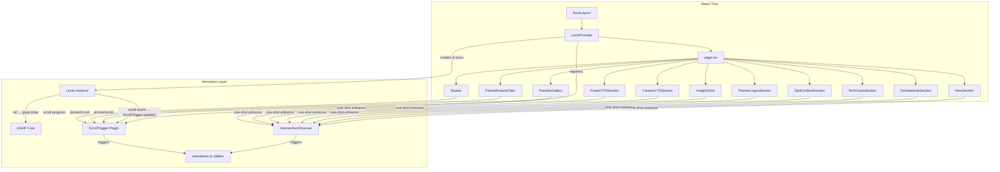

# Design Document: Scroll Animation System

## Overview

This design describes the migration of the Kenesis landing page from a Framer Motion v12 animation stack to a GSAP + ScrollTrigger + Lenis smooth scroll stack. The current codebase has 14+ components using Framer Motion's `useScroll`, `useTransform`, `useSpring`, `motion` components, and `AnimatePresence` for scroll-linked animations, entrance effects, parallax, and transitions. This migration replaces all of that with:

- **GSAP** for all animation orchestration (tweens, timelines, ScrollTrigger pinning/scrubbing)
- **Lenis** for inertia-based smooth scrolling synced to GSAP's ticker
- **IntersectionObserver** for lightweight one-shot entrance triggers
- **CSS transitions** for simple hover states

The page is restructured from the current 14+ component layout (with `SectionTransition` dividers) into 10 clean cinematic sections plus a Navbar. The animation system is centralized through a React context provider and shared utility functions, replacing the per-component Framer Motion approach.

### Key Design Decisions

1. **GSAP over Framer Motion**: GSAP's ScrollTrigger provides native pinning and scrub-linked animations without the overhead of React re-renders. Framer Motion's `useScroll`/`useTransform` pattern triggers React state updates on every scroll frame, which is less performant for scroll-heavy pages.
2. **Lenis for smooth scroll**: Replaces the current `SmoothScroll.tsx` (which only resets scroll position and fades in). Lenis provides actual inertia-based smooth scrolling and integrates directly with GSAP's update cycle.
3. **IntersectionObserver for one-shot entrances**: Simpler and more performant than ScrollTrigger for elements that just need a single entrance animation. ScrollTrigger is reserved for pinned/scrubbed sections.
4. **Centralized utilities over wrapper components**: The current `BlurFade`, `FadeIn`, `WordReveal` wrapper components are replaced by imperative GSAP utility functions (`fadeUp`, `clipReveal`, `bindParallax`) called from `useEffect` hooks. This avoids extra DOM wrappers and React reconciliation overhead.
5. **Three.js removal**: The `Hills.tsx` WebGL background in the footer is replaced by a full-bleed video, eliminating the `three` and `@types/three` dependencies.

## Architecture

### High-Level Component Tree

```
RootLayout (layout.tsx)
└── LenisProvider (new)
    └── main
        ├── Navbar (rewritten, GSAP scroll progress)
        ├── HeroSection (new, replaces Hero.tsx)
        ├── ParallaxGallery (new, replaces ParallaxFloating.tsx)
        ├── TextInterludeSection (new, replaces HeroTransition.tsx + Scale.tsx line)
        ├── PinnedFeatureTabs (new, replaces Platform.tsx)
        ├── TechCardsSection (new, replaces Technology.tsx)
        ├── SplitContentSection (new, no predecessor)
        ├── PartnerLogosSection (new, replaces Partners.tsx)
        ├── InsightsGrid (new, replaces Insights.tsx)
        ├── CareersCTASection (new, replaces CTA.tsx)
        └── FooterCTASection (new, replaces Footer.tsx + Hills.tsx)
```

### New File Structure

```
src/
├── app/
│   ├── globals.css              # Updated: remove marquee keyframe, add reduced-motion rules
│   ├── layout.tsx               # Unchanged (fonts, metadata)
│   └── page.tsx                 # Rewritten: LenisProvider wrapping 10 sections
├── components/
│   ├── LenisProvider.tsx        # NEW: Lenis init, GSAP ticker sync, React context
│   ├── Navbar.tsx               # REWRITTEN: GSAP scroll progress, no framer-motion
│   ├── HeroSection.tsx          # NEW: replaces Hero.tsx
│   ├── ParallaxGallery.tsx      # NEW: replaces ParallaxFloating.tsx
│   ├── TextInterludeSection.tsx # NEW: replaces HeroTransition.tsx
│   ├── PinnedFeatureTabs.tsx    # NEW: replaces Platform.tsx
│   ├── TechCardsSection.tsx     # NEW: replaces Technology.tsx
│   ├── SplitContentSection.tsx  # NEW: no predecessor
│   ├── PartnerLogosSection.tsx  # NEW: replaces Partners.tsx
│   ├── InsightsGrid.tsx         # NEW: replaces Insights.tsx
│   ├── CareersCTASection.tsx    # NEW: replaces CTA.tsx
│   └── FooterCTASection.tsx     # NEW: replaces Footer.tsx
├── lib/
│   ├── utils.ts                 # Unchanged (cn utility)
│   ├── animations.ts            # NEW: fadeUp, clipReveal, bindParallax, staggerChildren
│   └── useAnimateOnView.ts      # NEW: IntersectionObserver hook for one-shot entrances
```

### Files to Remove

| File | Reason |
|---|---|
| `SmoothScroll.tsx` | Replaced by `LenisProvider.tsx` |
| `FadeIn.tsx` | Replaced by `fadeUp` utility in `animations.ts` |
| `WordReveal.tsx` | Replaced by `clipReveal` utility in `animations.ts` |
| `SectionTransition.tsx` | Removed entirely — sections transition directly |
| `Hills.tsx` | Three.js WebGL removed — video replaces it |
| `magicui/BlurFade.tsx` | Replaced by `fadeUp` utility |
| `magicui/Marquee.tsx` | Replaced by staggered fade-in row |
| `magicui/NumberTicker.tsx` | Removed with Scale section |
| `magicui/BorderBeam.tsx` | Removed with Safety section |
| `magicui/ShimmerButton.tsx` | Removed — standard buttons used |
| `magicui/TextReveal.tsx` | Removed with ParallaxFloating |
| `Hero.tsx` | Replaced by `HeroSection.tsx` |
| `HeroTransition.tsx` | Replaced by `TextInterludeSection.tsx` |
| `ParallaxFloating.tsx` | Replaced by `ParallaxGallery.tsx` |
| `Platform.tsx` | Replaced by `PinnedFeatureTabs.tsx` |
| `Scale.tsx` | Removed — line concept absorbed into TextInterlude |
| `Technology.tsx` | Replaced by `TechCardsSection.tsx` |
| `Safety.tsx` | Removed from layout entirely |
| `Partners.tsx` | Replaced by `PartnerLogosSection.tsx` |
| `Insights.tsx` | Replaced by `InsightsGrid.tsx` |
| `CTA.tsx` | Replaced by `CareersCTASection.tsx` |
| `Footer.tsx` | Replaced by `FooterCTASection.tsx` |
| `ParallaxGrid.tsx` | Unused — remove |

### Files to Keep/Adapt

| File | Action |
|---|---|
| `magicui/MagicCard.tsx` | Keep — mouse-tracked gradient card, no Framer Motion dependency |
| `magicui/AnimatedShinyText.tsx` | Keep if used, otherwise remove |

### Dependency Changes

```diff
# package.json
- "framer-motion": "^12.0.0",
- "three": "^0.183.2",
- "@types/three": "^0.183.1",
+ "gsap": "^3.12.0",
+ "@studio-freight/lenis": "^1.0.0",
```

### Architecture Diagram



## Components and Interfaces

### 1. LenisProvider (`components/LenisProvider.tsx`)

A client component that wraps the entire page. Initializes Lenis, syncs it with GSAP's ticker, and exposes the Lenis instance via React context.

```typescript
// Context
interface LenisContextValue {
  lenis: Lenis | null;
}
const LenisContext = createContext<LenisContextValue>({ lenis: null });
export const useLenis = () => useContext(LenisContext);

// Provider behavior:
// 1. Creates Lenis instance on mount
// 2. Registers ScrollTrigger plugin: gsap.registerPlugin(ScrollTrigger)
// 3. Links Lenis scroll → ScrollTrigger.update()
// 4. Links gsap.ticker → lenis.raf(time * 1000)
// 5. Sets gsap.ticker.lagSmoothing(0)
// 6. On unmount: lenis.destroy(), ScrollTrigger.killAll()
// 7. Checks prefers-reduced-motion and disables Lenis smooth if active

// Props
interface LenisProviderProps {
  children: React.ReactNode;
}
```

### 2. Animation Utilities (`lib/animations.ts`)

Imperative GSAP utility functions. No React dependencies — pure GSAP calls.

```typescript
import gsap from 'gsap';
import { ScrollTrigger } from 'gsap/ScrollTrigger';

// Checks prefers-reduced-motion media query
export function prefersReducedMotion(): boolean;

// Fade-up entrance: opacity 0→1, translateY(30px→0), 0.8s, expo.out
// If reduced motion: sets final state immediately
export function fadeUp(el: Element, delay?: number): gsap.core.Tween;

// Clip-reveal: translateY(100%→0) within overflow-hidden parent, 1.1s, expo.out
// If reduced motion: sets final state immediately
export function clipReveal(el: Element, delay?: number): gsap.core.Tween;

// Scroll-driven parallax: translateY based on scroll progress × factor
// If reduced motion: no-op
export function bindParallax(mediaEl: Element, factor?: number): ScrollTrigger;

// Stagger children: applies fadeUp to each child with 120ms stagger
export function staggerChildren(container: Element, staggerMs?: number): gsap.core.Tween[];
```

### 3. useAnimateOnView Hook (`lib/useAnimateOnView.ts`)

A custom hook that uses IntersectionObserver to trigger one-shot entrance animations.

```typescript
interface UseAnimateOnViewOptions {
  threshold?: number;       // default 0.15 (trigger at 15% visibility)
  rootMargin?: string;      // default '0px 0px -15% 0px' (trigger at ~85% viewport)
  once?: boolean;           // default true
  onEnter?: (el: Element) => void;  // callback when element enters
}

export function useAnimateOnView(
  ref: React.RefObject<Element>,
  options?: UseAnimateOnViewOptions
): { isInView: boolean };
```

### 4. Navbar (`components/Navbar.tsx`)

Rewritten to remove all Framer Motion imports. Uses GSAP for:
- Initial entrance animation (translateY -80→0, opacity 0→1)
- Scroll progress bar width linked to ScrollTrigger
- Mobile menu open/close with CSS transitions (no AnimatePresence)

```typescript
// Key changes from current:
// - Replace motion.header with div + useEffect GSAP tween
// - Replace useScroll/useTransform for progress bar with ScrollTrigger.create
// - Replace AnimatePresence mobile menu with CSS transition + state toggle
```

### 5. HeroSection (`components/HeroSection.tsx`)

100vh hero with background video, Ken Burns effect, clip-reveal heading, and CTA.

```typescript
// Structure:
// <section> 100vh, dark background
//   <video> autoplay muted loop, object-fit cover
//     CSS: transform scale(1.05), transition transform 8s on load → scale(1)
//   <div> gradient overlay
//   <div> content container
//     <span> eyebrow: letter-spacing 0.3em→0.06em, opacity 0→1, 0.9s
//     <h1>
//       <span> line 1: clipReveal, 1.1s
//       <span> line 2: clipReveal, 1.1s, 200ms delay
//     <a> CTA button: fadeUp, 300ms delay, hover scale 1.03

// Animation trigger: useAnimateOnView (fires on page load since hero is visible)
// Ken Burns: CSS transition on video element, toggled via useEffect on mount
// Reduced motion: skip Ken Burns, show text immediately
```

### 6. ParallaxGallery (`components/ParallaxGallery.tsx`)

Tall vertical section (~500vh) with alternating fullscreen media panels.

```typescript
// Structure:
// <section> ~500vh total
//   {panels.map(panel =>
//     <div> 100vh container, overflow hidden
//       <div> 130vh media element
//          or <video> object-fit cover
//   )}

// Animation: GSAP ScrollTrigger per panel
//   - bindParallax(mediaEl, 0.4) for vertical parallax
//   - ScrollTrigger scrub: scale 1.0→1.04 on enter
// No text overlays — media only
// Videos: autoplay muted loop
```

### 7. TextInterludeSection (`components/TextInterludeSection.tsx`)

Centered narrow text block with decorative animated line.

```typescript
// Structure:
// <section> centered, max-width ~80rem
//   <div> decorative line: width 0→100%, 0.6s, ease-out
//   <h2> heading: fadeUp
//   <p> paragraph: fadeUp, 150ms delay, 1.1s duration

// Animation trigger: IntersectionObserver via useAnimateOnView
// Line animation: GSAP tween on width or scaleX, triggered by observer
```

### 8. PinnedFeatureTabs (`components/PinnedFeatureTabs.tsx`)

GSAP-pinned section with 3 scroll-driven tabs.

```typescript
// Structure:
// <section> ref for ScrollTrigger pin
//   <div> pinned container (100vh)
//     <div> tab bar
//       {tabs.map(tab =>
//         <button> tab label + underline (scaleX 0→1 when active)
//       )}
//     <div> content area
//       {tabs.map(tab =>
//         <div> tab content (text + details)
//       )}
//     <div> video background
//       {tabs.map(tab =>
//         <video> crossfade via opacity transition 0.5s
//       )}

// Animation: ScrollTrigger.create({
//   trigger: section, pin: true, scrub: true,
//   start: 'top top', end: '+=300vh'
// })
// Tab switching: divide scroll progress into thirds (0-33%, 33-66%, 66-100%)
// Content exit: translateY 0→-20px, opacity 1→0, 0.3s
// Content enter: translateY 20px→0, opacity 0→1, 0.5s
// Video crossfade: opacity 0→1, 0.5s transition
```

### 9. TechCardsSection (`components/TechCardsSection.tsx`)

Section heading over parallax background with 3 staggered cards.

```typescript
// Structure:
// <section> relative, overflow hidden
//   <div> background image, bindParallax(el, 0.25)
//   <div> content
//     <h2> heading: fadeUp
//     <div> 3-column card grid
//       {cards.map(card =>
//         <div> card: staggered entrance (opacity, scale 0.97→1, translateY 40→0)
//           <div> video overlay (opacity 0→1 on hover)
//           <div> card content
//       )}

// Entrance: staggerChildren with 150ms stagger, 0.8s per card
// Hover: CSS transition translateY -6px, deeper shadow
// Video hover: CSS transition opacity 0→1
```

### 10. SplitContentSection (`components/SplitContentSection.tsx`)

Two-column layout with opposing horizontal slide-ins.

```typescript
// Structure:
// <section> two-column grid
//   <div> left column (text): translateX(-60px→0), opacity 0→1, 0.9s
//   <div> right column (image): translateX(60px→0), opacity 0→1, 0.9s

// Animation trigger: useAnimateOnView
// Both columns animate simultaneously
```

### 11. PartnerLogosSection (`components/PartnerLogosSection.tsx`)

Heading, logo row, and testimonial with staggered entrances.

```typescript
// Structure:
// <section>
//   <h2> heading: fadeUp
//   <div> logo row
//     {logos.map(logo =>
//       <div> logo: staggered fade-in, 100ms intervals, 0.6s each
//         hover: scale 1→1.05, 0.2s CSS transition
//     )}
//   <blockquote> testimonial: fadeUp, 200ms delay after last logo

// Animation trigger: useAnimateOnView for heading + logos
// Testimonial delay calculated from logo count × 100ms + 200ms
```

### 12. InsightsGrid (`components/InsightsGrid.tsx`)

3-column article card grid with row-staggered entrance.

```typescript
// Structure:
// <section>
//   <div> header (title + "view all" link)
//   <div> 3-column grid
//     {articles.map((article, i) =>
//       <div> card: fadeUp, delay = (i % 3) * 150ms, 0.75s
//         <div> thumbnail: hover scale 1→1.07, overflow hidden
//         <h3> heading: hover underline 0→100%
//     )}

// Row stagger: column 0 = 0ms, column 1 = 150ms, column 2 = 300ms
// Hover effects: pure CSS transitions
```

### 13. CareersCTASection (`components/CareersCTASection.tsx`)

2×2 mosaic photo grid with convergence + clip-reveal heading.

```typescript
// Structure:
// <section>
//   <div> 2×2 mosaic grid
//     <div> top-left: translateX(-40px→0), opacity 0→1, 1.0s
//     <div> top-right: translateX(40px→0), opacity 0→1, 1.0s
//     <div> bottom-left: translateY(40px→0), opacity 0→1, 1.0s
//     <div> bottom-right: translateY(40px→0), opacity 0→1, 1.0s, 100ms delay
//   <h2> heading: clipReveal
//   <a> CTA button: fadeUp, 200ms delay
//     hover: scale 1.03 + glow box-shadow

// Animation trigger: useAnimateOnView
// Mosaic images animate via GSAP tweens with custom from values
```

### 14. FooterCTASection (`components/FooterCTASection.tsx`)

Full-bleed video background with opacity-faded heading and staggered footer links.

```typescript
// Structure:
// <footer> full-bleed, dark
//   <video> background, autoplay muted loop, object-fit cover
//   <div> content
//     <h2> heading: opacity 0→1, 1.4s (pure opacity, no translateY)
//     <div> footer links
//       {links.map(link =>
//         <a> staggered fadeUp, 600ms after heading, 80ms stagger
//       )}
//     <div> copyright bar

// Animation trigger: useAnimateOnView
// Heading uses custom GSAP tween (opacity only, not fadeUp)
```

## Data Models

### Animation Configuration Types

```typescript
// lib/animations.ts types

interface FadeUpOptions {
  delay?: number;          // default 0
  duration?: number;       // default 0.8
  y?: number;              // default 30 (pixels)
  ease?: string;           // default 'expo.out'
}

interface ClipRevealOptions {
  delay?: number;          // default 0
  duration?: number;       // default 1.1
  ease?: string;           // default 'expo.out'
}

interface ParallaxOptions {
  factor?: number;         // default 0.4 (percentage of scroll delta)
  start?: string;          // default 'top bottom'
  end?: string;            // default 'bottom top'
}

interface StaggerOptions {
  staggerMs?: number;      // default 120
  animation?: 'fadeUp' | 'clipReveal';
}
```

### Section Data Structures

```typescript
// PinnedFeatureTabs data
interface FeatureTab {
  id: string;
  label: string;
  title: string;
  description: string;
  videoSrc: string;
}

// TechCardsSection data
interface TechCard {
  title: string;
  description: string;
  backgroundImage: string;
  hoverVideoSrc: string;
}

// InsightsGrid data
interface ArticleCard {
  source: string;
  title: string;
  date: string;
  tag: string;
  thumbnailGradient: string;
}

// PartnerLogosSection data
interface Partner {
  name: string;
  logoSrc?: string;
}

interface Testimonial {
  quote: string;
  authorName: string;
  authorTitle: string;
  authorInitial: string;
}

// ParallaxGallery data
interface GalleryPanel {
  type: 'image' | 'video';
  src: string;
  poster?: string;
  alt?: string;
}

// CareersCTASection mosaic
interface MosaicImage {
  src: string;
  alt: string;
  position: 'top-left' | 'top-right' | 'bottom-left' | 'bottom-right';
}
```

### Lenis Context Shape

```typescript
interface LenisContextValue {
  lenis: Lenis | null;
}
```

### Reduced Motion State

The `prefersReducedMotion()` function reads `window.matchMedia('(prefers-reduced-motion: reduce)')` once and caches the result. It is checked at the start of every animation utility. When true:

- `fadeUp` → sets element to final state (opacity 1, y 0) immediately
- `clipReveal` → sets element to final state (yPercent 0) immediately
- `bindParallax` → returns early, no ScrollTrigger created
- Ken Burns → CSS class not applied
- Hover interactions → allowed but with `transition-duration: 0s`

## Correctness Properties

*A property is a characteristic or behavior that should hold true across all valid executions of a system — essentially, a formal statement about what the system should do. Properties serve as the bridge between human-readable specifications and machine-verifiable correctness guarantees.*

### Property 1: fadeUp tween configuration

*For any* DOM element passed to `fadeUp(el, delay)`, the resulting GSAP tween SHALL animate from `{ opacity: 0, y: 30 }` to `{ opacity: 1, y: 0 }` with duration 0.8s, ease `'expo.out'`, and the specified delay value.

**Validates: Requirements 3.1**

### Property 2: clipReveal tween configuration

*For any* DOM element passed to `clipReveal(el, delay)`, the resulting GSAP tween SHALL animate from `{ yPercent: 100 }` to `{ yPercent: 0 }` with duration 1.1s, ease `'expo.out'`, and the specified delay value.

**Validates: Requirements 3.2**

### Property 3: bindParallax scroll-driven translateY

*For any* DOM element and parallax factor `f`, calling `bindParallax(el, f)` SHALL create a ScrollTrigger where at any scroll progress `p` in [0, 1], the element's translateY equals `p × parentHeight × f`. This subsumes the ParallaxGallery's 0.4 factor (Req 7.3) as a specific instance.

**Validates: Requirements 3.3, 7.3**

### Property 4: staggerChildren delay sequence

*For any* container element with `N` children, calling `staggerChildren(container, staggerMs)` SHALL apply fadeUp to each child `i` with delay `i × staggerMs` milliseconds, where the default staggerMs is 120.

**Validates: Requirements 3.4**

### Property 5: will-change applied to all animated elements

*For any* DOM element animated by `fadeUp`, `clipReveal`, or `bindParallax`, the element SHALL have `will-change: transform` set on it before the animation begins.

**Validates: Requirements 3.5, 16.1**

### Property 6: Cleanup on unmount

*For any* DOM element that was animated by `fadeUp`, `clipReveal`, or `bindParallax`, when the owning React component unmounts, the element's `will-change` property SHALL be reset to `auto` and all associated GSAP tweens/ScrollTriggers SHALL be killed.

**Validates: Requirements 16.3**

### Property 7: ParallaxGallery equal treatment of media types

*For any* ParallaxGallery panel, regardless of whether it contains an image or video, the parallax factor and scale-on-enter scrub range SHALL be identical.

**Validates: Requirements 7.5**

### Property 8: PinnedFeatureTabs scroll-to-tab mapping

*For any* scroll progress value `p` in [0, 1] within the PinnedFeatureTabs pinned region, the active tab index SHALL be `min(floor(p × 3), 2)`, and only that tab's underline SHALL have `scaleX(1)` (all others `scaleX(0)`), and only that tab's background video SHALL have `opacity: 1` (all others `opacity: 0`).

**Validates: Requirements 9.2, 9.3, 9.6**

### Property 9: PartnerLogos stagger timing

*For any* set of `N` partner logos, logo at index `i` SHALL have entrance delay `i × 100`ms with duration 0.6s, and the testimonial block SHALL have entrance delay `(N - 1) × 100 + 200`ms.

**Validates: Requirements 12.3, 12.4**

### Property 10: InsightsGrid row-stagger delay

*For any* article card at index `i` in the InsightsGrid, the entrance delay SHALL be `(i % 3) × 150`ms with a fadeUp duration of 0.75s.

**Validates: Requirements 13.2**

### Property 11: CareersCTA mosaic directional mapping

*For any* mosaic image position in the CareersCTASection, the entrance animation direction SHALL map as: top-left → `translateX(-40px)`, top-right → `translateX(40px)`, bottom-left → `translateY(40px)`, bottom-right → `translateY(40px)` with 100ms additional delay. All animations SHALL have duration 1.0s.

**Validates: Requirements 14.2**

### Property 12: FooterCTA links stagger timing

*For any* set of `N` footer links in the FooterCTASection, link at index `i` SHALL have entrance delay `600 + i × 80`ms using the fadeUp animation.

**Validates: Requirements 15.3**

### Property 13: Reduced motion disables all animations

*For any* element that would be animated by `fadeUp`, `clipReveal`, or `bindParallax`, when `prefers-reduced-motion: reduce` is active, the utility SHALL set the element to its final state immediately (no tween created) and `bindParallax` SHALL be a no-op (no ScrollTrigger created). Ken Burns CSS transitions SHALL not be applied.

**Validates: Requirements 17.1, 17.2**

## Error Handling

### Animation Failures

| Scenario | Handling |
|---|---|
| GSAP fails to load or register ScrollTrigger | LenisProvider catches the error and renders children without animations. Console warning logged. |
| Lenis fails to initialize | Fallback to native browser scrolling. ScrollTrigger still works without Lenis smooth scroll. |
| Element ref is null when animation utility is called | All utilities (`fadeUp`, `clipReveal`, `bindParallax`) check for null/undefined element and return early with no-op. |
| ScrollTrigger pin target not found | GSAP logs a warning. PinnedFeatureTabs renders in static (unpinned) layout. |
| Video fails to load (HeroSection, ParallaxGallery, FooterCTA) | Poster image displayed as fallback. Animations still apply to the container element. |
| IntersectionObserver not supported | `useAnimateOnView` falls back to showing elements in their final state immediately (same as reduced motion). |
| Multiple rapid scroll events | Lenis debounces internally. GSAP ScrollTrigger handles rapid updates natively via its refresh mechanism. |
| Component unmounts during active animation | Cleanup in `useEffect` return kills all GSAP tweens and ScrollTriggers associated with the component's refs. |

### Graceful Degradation Order

1. Full experience: Lenis smooth scroll + GSAP ScrollTrigger + IntersectionObserver
2. No Lenis: Native scroll + GSAP ScrollTrigger + IntersectionObserver
3. No GSAP: Elements rendered in final state, no animations
4. Reduced motion: Elements in final state, hover interactions with 0s duration

## Testing Strategy

### Dual Testing Approach

This project uses both unit tests and property-based tests for comprehensive coverage:

- **Unit tests**: Verify specific examples, edge cases, integration points, and error conditions
- **Property-based tests**: Verify universal properties across randomly generated inputs

### Property-Based Testing Configuration

- **Library**: [fast-check](https://github.com/dubzzz/fast-check) for TypeScript/JavaScript property-based testing
- **Minimum iterations**: 100 per property test
- **Each property test MUST reference its design document property with a tag comment**
- **Tag format**: `// Feature: scroll-animation-system, Property {number}: {property_text}`
- **Each correctness property MUST be implemented by a SINGLE property-based test**

### Unit Test Scope

Unit tests (using Vitest + jsdom or Playwright for DOM tests) cover:

1. **Dependency migration** (Req 1): Verify package.json contains gsap and lenis, does not contain framer-motion or three
2. **LenisProvider initialization** (Req 2): Verify Lenis instance is created, context provides it, cleanup destroys it
3. **Page structure** (Req 5): Verify section order in DOM, absence of SectionTransition/Safety/Scale
4. **HeroSection** (Req 6): Verify 100vh height, video attributes (autoplay, muted, loop), Ken Burns class, eyebrow animation params, clip-reveal on heading lines, CTA delay, hover scale
5. **ParallaxGallery** (Req 7): Verify panel dimensions (100vh container, 130vh media), no text overlays, video attributes
6. **TextInterludeSection** (Req 8): Verify line animation (width 0→100%, 0.6s), heading fadeUp, paragraph delay 150ms
7. **PinnedFeatureTabs** (Req 9): Verify ScrollTrigger pin with 300vh, 3 tabs rendered, content exit/enter animation params, video crossfade 0.5s
8. **TechCardsSection** (Req 10): Verify parallax factor 0.25, 3 cards, stagger 150ms, hover translateY -6px, video opacity hover
9. **SplitContentSection** (Req 11): Verify two-column layout, translateX ±60px, 0.9s duration, simultaneous trigger
10. **PartnerLogosSection** (Req 12): Verify heading fadeUp, logo hover scale 1.05
11. **InsightsGrid** (Req 13): Verify 3-column grid, thumbnail hover scale 1.07, overflow hidden, heading underline hover
12. **CareersCTASection** (Req 14): Verify 2×2 grid, clipReveal on heading, CTA delay 200ms, hover scale 1.03 + glow
13. **FooterCTASection** (Req 15): Verify full-bleed video, heading opacity-only fade 1.4s
14. **Reduced motion** (Req 17): Verify hover interactions still work with 0s duration
15. **Navbar** (Req 5.5): Verify fixed positioning, scroll progress bar

### Property-Based Test Scope

Each property from the Correctness Properties section maps to one property-based test:

| Property | Test Description | Generator |
|---|---|---|
| P1: fadeUp config | Generate random elements and delays, verify tween params | `fc.record({ delay: fc.float({ min: 0, max: 2 }) })` |
| P2: clipReveal config | Generate random elements and delays, verify tween params | `fc.record({ delay: fc.float({ min: 0, max: 2 }) })` |
| P3: bindParallax translateY | Generate random factors and scroll progress values, verify translateY | `fc.record({ factor: fc.float({ min: 0.1, max: 1 }), progress: fc.float({ min: 0, max: 1 }) })` |
| P4: staggerChildren | Generate random child counts and stagger values, verify delay sequence | `fc.record({ childCount: fc.integer({ min: 1, max: 20 }), staggerMs: fc.integer({ min: 50, max: 500 }) })` |
| P5: will-change applied | Generate random elements, animate them, verify will-change is set | `fc.constantFrom('fadeUp', 'clipReveal', 'bindParallax')` |
| P6: Cleanup on unmount | Generate animated elements, simulate unmount, verify cleanup | `fc.constantFrom('fadeUp', 'clipReveal', 'bindParallax')` |
| P7: Equal media treatment | Generate panels with random image/video types, verify same parallax | `fc.array(fc.constantFrom('image', 'video'), { minLength: 2, maxLength: 10 })` |
| P8: Scroll-to-tab mapping | Generate random scroll progress values, verify tab index and UI state | `fc.float({ min: 0, max: 1 })` |
| P9: Partner stagger timing | Generate random logo counts, verify delay sequence and testimonial delay | `fc.integer({ min: 1, max: 20 })` |
| P10: InsightsGrid stagger | Generate random card indices, verify delay formula | `fc.integer({ min: 0, max: 50 })` |
| P11: Mosaic directions | Generate all 4 positions, verify animation direction mapping | `fc.constantFrom('top-left', 'top-right', 'bottom-left', 'bottom-right')` |
| P12: Footer links stagger | Generate random link counts, verify delay formula | `fc.integer({ min: 1, max: 30 })` |
| P13: Reduced motion | Generate random elements and animation types, verify final state with no tween | `fc.record({ type: fc.constantFrom('fadeUp', 'clipReveal', 'bindParallax'), reducedMotion: fc.constant(true) })` |

### Test File Structure

```
src/
├── lib/
│   ├── __tests__/
│   │   ├── animations.test.ts          # Unit tests for animation utilities
│   │   ├── animations.property.test.ts # Property tests P1-P6, P13
│   │   └── useAnimateOnView.test.ts    # Unit tests for the hook
├── components/
│   ├── __tests__/
│   │   ├── LenisProvider.test.tsx       # Unit tests for provider init/cleanup
│   │   ├── PinnedFeatureTabs.property.test.tsx  # Property test P8
│   │   ├── PartnerLogosSection.property.test.tsx # Property test P9
│   │   ├── InsightsGrid.property.test.tsx        # Property test P10
│   │   ├── CareersCTASection.property.test.tsx   # Property test P11
│   │   ├── FooterCTASection.property.test.tsx    # Property test P12
│   │   ├── ParallaxGallery.property.test.tsx     # Property test P7
│   │   └── sections.test.tsx            # Unit tests for all section components
```
