# Kenesis Labs — Website Sections & Components

> Edge AI that sees what matters. On your premises. Under your control.

## Sitemap

| Route | Page | Description |
|-------|------|-------------|
| `/` | Home | Hero + capabilities + performance + tech cards + industries + news + CTA + footer |
| `/platform` | Platform | Edge AI stack, how it works, specs, pricing |
| `/solutions/ppe-compliance` | PPE Compliance | Helmet/vest/glove detection, contextual alerts |
| `/solutions/zone-detection` | Zone Detection | Restricted area & perimeter breach monitoring |
| `/solutions/analytics` | Analytics | Headcount, attendance, shift-level dashboards |
| `/about` | About | Company story, why we exist, why now |
| `/contact` | Contact | Chennai HQ, contact form |
| `/news` | News | Article listing |
| `/news/[slug]` | News Article | Dynamic article pages |
| `/privacy-policy` | Privacy Policy | Legal |
| `/terms-of-use` | Terms of Use | Legal |

---

## Home Page (`/`) — Sections

### 1. Navbar
**Component:** `src/components/Navbar.tsx`
- Floating frosted glass navbar
- MBF Neo Wave logo text ("KENESIS")
- Monospace uppercase nav links: Platform, Solutions, About, News, Contact
- Amber scroll progress bar
- Mobile hamburger overlay

---

### 2. Hero Section
**Component:** `src/components/HeroSection.tsx`
- Full-viewport parallax image gallery
- Center image with clip-path expansion on scroll
- 4 floating parallax images with GSAP ScrollTrigger

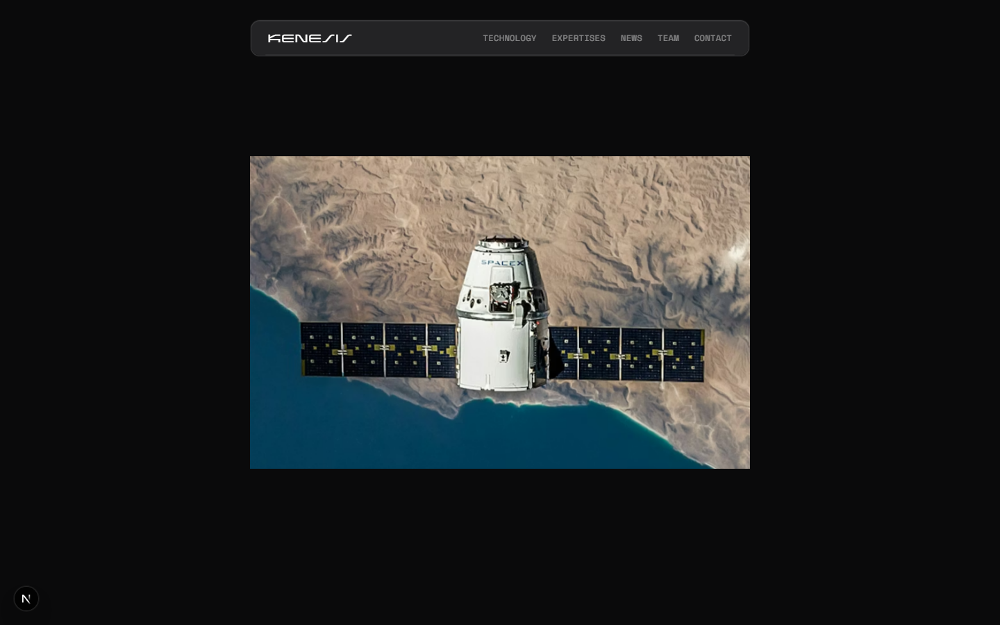

---

### 3. Pinned Feature Tabs — "Edge AI that sees what matters"
**Component:** `src/components/PinnedFeatureTabs.tsx`
- ScrollTrigger-pinned section (300vh)
- 3 tabs: Detect (YOLOv8) / Reason (Qwen2.5-VL) / Control (on-premise)
- Left: heading + description. Right: tabs + video placeholder

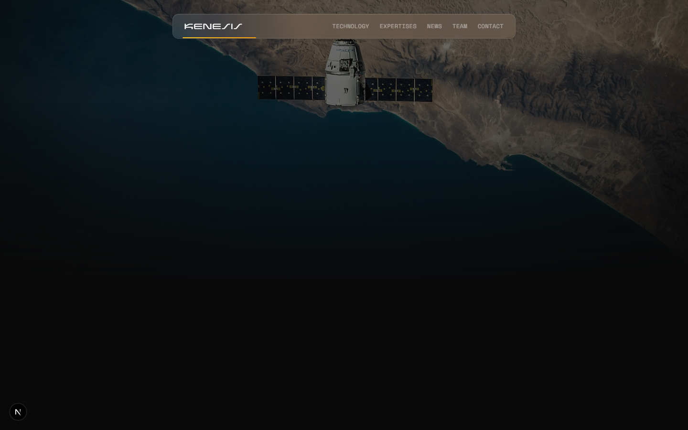

---

### 4. Wave Performance — "30 Cameras. 35 Watts."
**Components:** `src/components/WavePerformanceSection.tsx` + `src/components/ColorfulWave.tsx`
- Raw WebGL shader background (amber volumetric glow)
- Magnetic cursor interaction
- Stats: Mac Mini M4 Pro handles 30 cameras at 35W

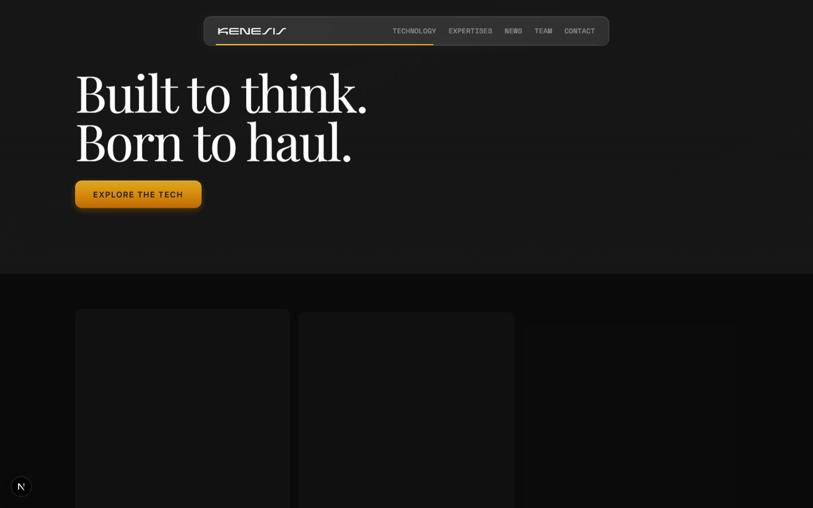

---

### 5. Tech Cards Banner — "Built to detect. Born to protect."
**Component:** `src/components/TechCardsSection.tsx` (top)
- Large Playfair Display heading
- Parallax background + amber CTA button

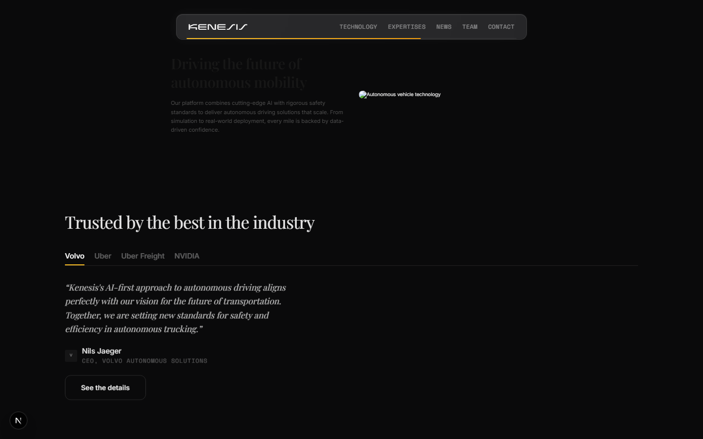

---

### 6. Tech Cards Grid — Solutions
**Component:** `src/components/TechCardsSection.tsx` (bottom)
- 3 cards: PPE Compliance / Zone Detection / Shift Analytics
- Staggered GSAP fadeUp entrance

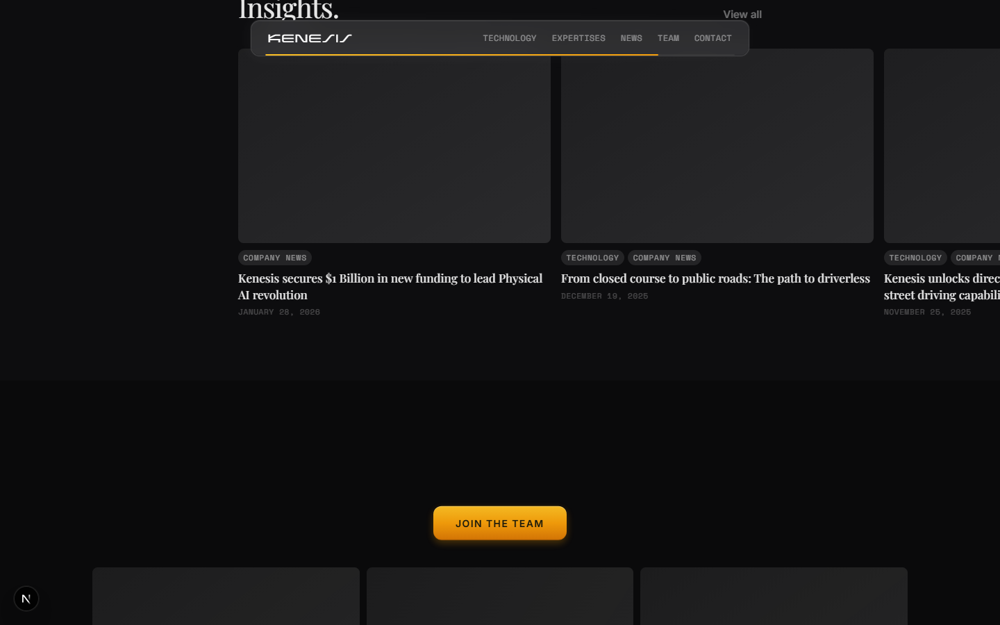

---

### 7. Split Content — "Your cameras already see everything"
**Component:** `src/components/SplitContentSection.tsx`
- 2-column: text left, factory image right
- GSAP slide-in animations

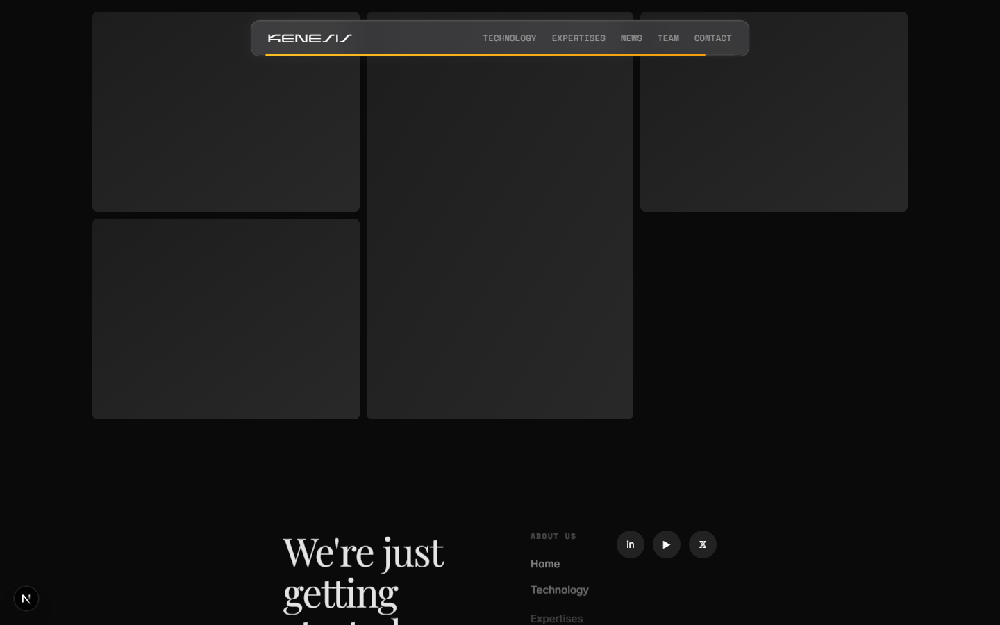

---

### 8. Industries — "Trusted by Indian industry"
**Component:** `src/components/PartnerLogosSection.tsx`
- Tabs: Manufacturing / Pharma / Logistics / Infrastructure
- Testimonial quotes per industry
- Amber tab underline indicator

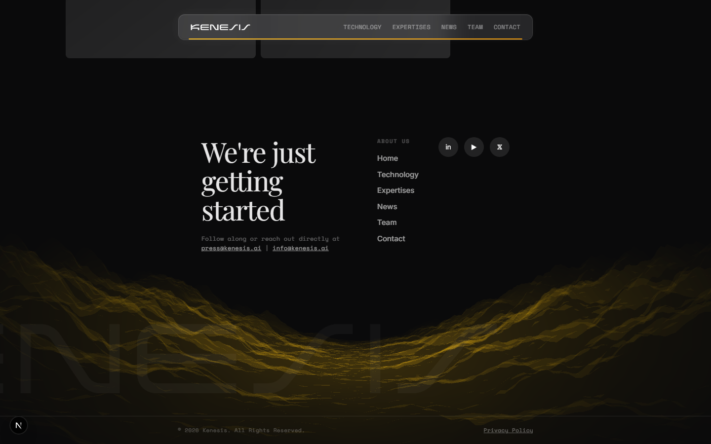

---

### 9. Insights Grid
**Component:** `src/components/InsightsGrid.tsx`
- Horizontal scrolling article cards
- Kenesis Labs news (edge AI, PPE, benchmarks, data sovereignty)

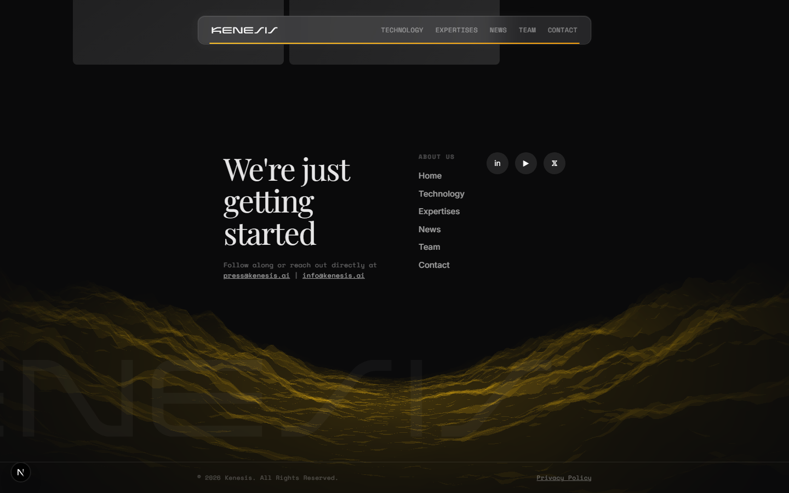

---

### 10. Careers CTA — "Build edge AI with us"
**Component:** `src/components/CareersCTASection.tsx`
- Large heading with clip-reveal animation
- Mosaic photo grid

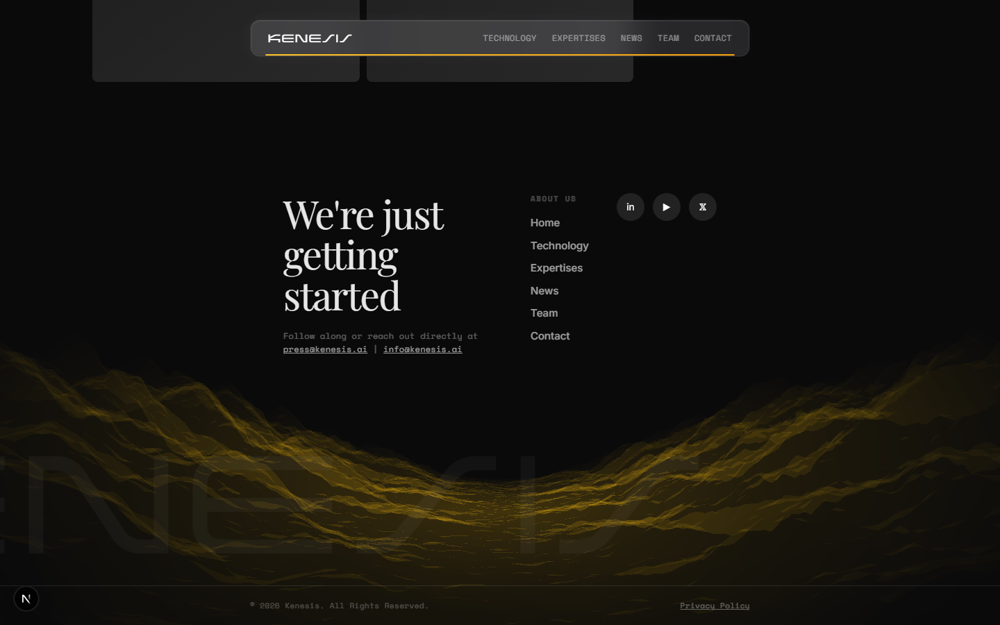

---

### 11. Footer
**Components:** `src/components/FooterCTASection.tsx` + `src/components/GLSLHills.tsx`
- GLSL Hills wireframe terrain (yellow #fde047)
- "We're just getting started" heading
- Nav links, social icons, MBF Neo Wave watermark
- Chennai, India copyright

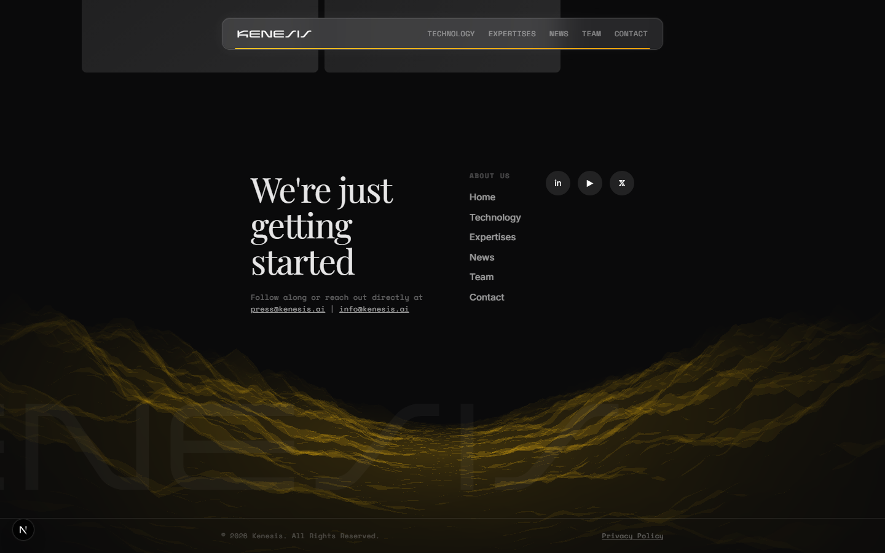

---

## Sub Pages

All use `PageShell` wrapper (`src/components/PageShell.tsx`) → Navbar + content + Footer.

### Platform (`/platform`)
Edge AI stack details, 5-step "How it works", technical specs table, pricing comparison (₹1,500/cam vs cloud ₹839/cam).

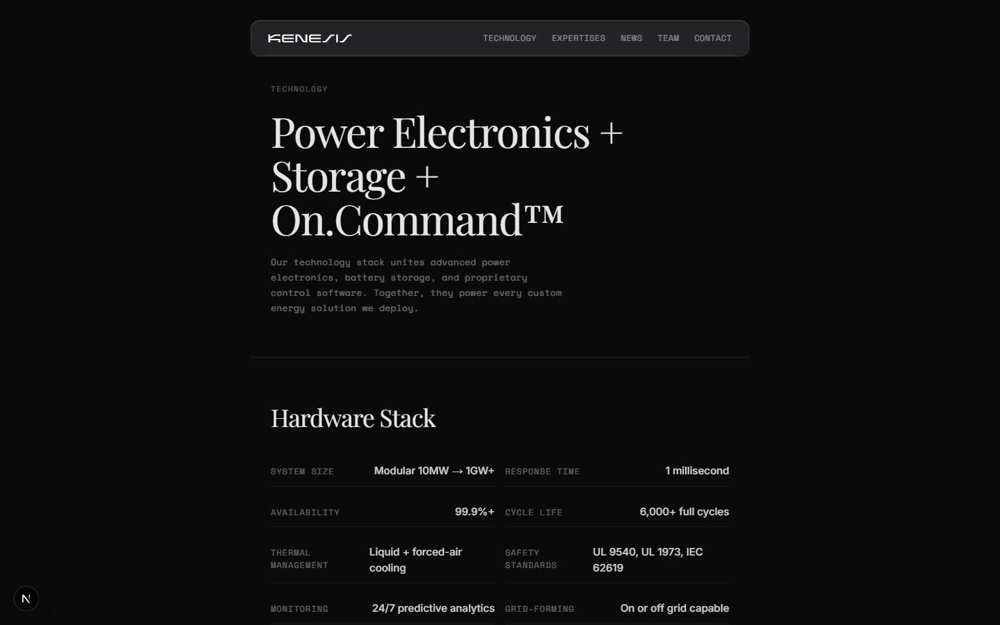

### PPE Compliance (`/solutions/ppe-compliance`)
Detection types (helmets, vests, gloves, etc.), contextual vs generic alerts, offline capability.

### Zone Detection (`/solutions/zone-detection`)
Restricted areas, perimeter breach, contextual alerts.

### Analytics (`/solutions/analytics`)
Headcount, attendance, shift reports, custom dashboards.

### About (`/about`)
Company story, "Why we exist", "Why now" (PLI schemes, China+1), company details (CIN, Chennai HQ).

### Contact (`/contact`)
Chennai HQ address, CIN, contact form with "Request a demo" CTA.

### News (`/news`)
Article listing with tags and dates. Dynamic `/news/[slug]` pages.

### Legal
`/privacy-policy` and `/terms-of-use` — standard legal pages.

---

## Shared Components

| Component | File | Used In |
|-----------|------|---------|
| PageShell | `src/components/PageShell.tsx` | All sub pages |
| Navbar | `src/components/Navbar.tsx` | All pages |
| FooterCTASection | `src/components/FooterCTASection.tsx` | All pages |
| GLSLHills | `src/components/GLSLHills.tsx` | Footer |
| ColorfulWave | `src/components/ColorfulWave.tsx` | WavePerformanceSection |
| ErrorBoundary | `src/components/ErrorBoundary.tsx` | Wraps WebGL sections |
| LenisProvider | `src/components/LenisProvider.tsx` | Smooth scroll |

## Typography

| Role | Font | Class |
|------|------|-------|
| Display headings | Playfair Display | `.font-display` |
| Body | Inter | `.font-body` |
| Labels / Tags | Space Mono | `.font-mono-accent` |
| Logo | MBF Neo Wave | `.font-logo` |

## Color Palette

| Token | Value | Usage |
|-------|-------|-------|
| Surface | `#0a0a0b` | Background |
| Accent | `#f59e0b` | Amber highlights |
| Text Primary | `white/90` | Headings |
| Text Secondary | `white/50` | Body |
| Text Muted | `white/30-40` | Labels |
| Glass | `white/0.06` | Cards |

## Company Info

- **Name:** Kenesis Labs Private Limited
- **CIN:** U62099TN2025PTC178068
- **HQ:** Chennai, Tamil Nadu, India
- **Founded:** 2025
- **Industry:** AI · Computer Vision · Industrial IoT · Factory Safety
